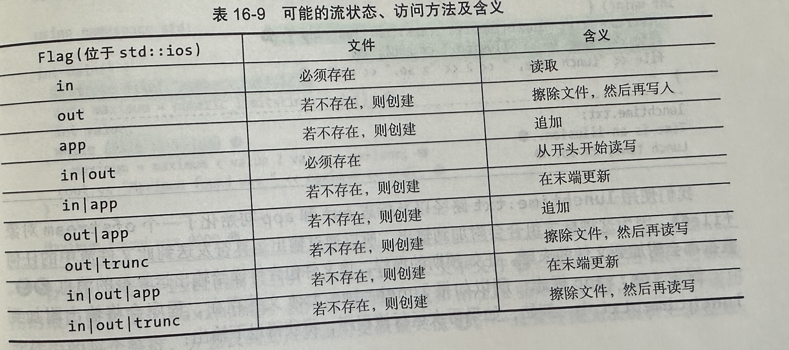

# C++中的文件流

## 文件流的状态

 

##  引入

在 C++ 中，文件流是用于对文件进行输入和输出操作的一种机制。文件流使得可以使用类似于标准输入输出流的方式来读取和写入文件内容。C++中文件流主要由以下两种类支持：

1. **ifstream**：这是用于从文件中读取数据的输入文件流类，通常用于读取文件内容。
2. **ofstream**：这是用于向文件中写入数据的输出文件流类，通常用于写入文件内容。

这两个类都是通过`<fstream>`头文件中定义的，并且都是继承自`istream`和`ostream`类，因此它们都具有这些类提供的输入和输出功能。

+ ifstream 示例

```C++
#include <fstream>
#include <iostream>
using namespace std;

int main() {
    ifstream inFile("input.txt");
    if (inFile.is_open()) {
        char ch;
        while (inFile.get(ch)) {
            cout << ch; // 输出文件内容
        }
        inFile.close();
    } else {
        cerr << "Unable to open file for reading." << endl;
    }
    return 0;
}
```

+ ofstream 示例

```c++
#include <fstream>
#include <iostream>
using namespace std;

int main() {
    ofstream outFile("output.txt");
    if (outFile.is_open()) {
        outFile << "This is written to the file." << endl;
        outFile.close();
    } else {
        cerr << "Unable to open file for writing." << endl;
    }
    return 0;
}
```

## 举例

### 例子一：读取文件内容并显示

```c++
#include <iostream>
#include <fstream>
#include <string>
using namespace std;

int main() {
    string line;
    ifstream inFile("input.txt");
    if (inFile.is_open()) {
        while (getline(inFile, line)) {
            cout << line << endl;
        }
        inFile.close();
    } else {
        cerr << "Unable to open file for reading." << endl;
    }
    return 0;
}
```

### 例子二：写入数据到文件

```c++
#include <iostream>
#include <fstream>
using namespace std;

int main() {
    ofstream outFile("output.txt");
    if (outFile.is_open()) {
        for (int i = 1; i <= 10; ++i) {
            outFile << "This is line " << i << endl;
        }
        outFile.close();
    } else {
        cerr << "Unable to open file for writing." << endl;
    }
    return 0;
}
```

### 例子三：使用二进制文件流读写二进制文件

```c++
#include <iostream>
#include <fstream>
using namespace std;

struct Record {
    int id;
    double value;
};

int main() {
    // 写入二进制文件
    Record records[] = {{1, 3.14}, {2, 6.28}, {3, 9.42}};
    ofstream outFile("records.bin", ios::out | ios::binary);
    if (outFile.is_open()) {
        outFile.write(reinterpret_cast<const char*>(&records), sizeof(records));
        outFile.close();
    } else {
        cerr << "Unable to open file for writing." << endl;
    }

    // 读取二进制文件
    Record recordsIn[3];
    ifstream inFile("records.bin", ios::in | ios::binary);
    if (inFile.is_open()) {
        inFile.read(reinterpret_cast<char*>(&recordsIn), sizeof(recordsIn));
        for (const auto& record : recordsIn) {
            cout << "ID: " << record.id << ", Value: " << record.value << endl;
        }
        inFile.close();
    } else {
        cerr << "Unable to open file for reading." << endl;
    }
    return 0;
}
```

### 例子四：使用文件流进行追加写入

```c++
#include <iostream>
#include <fstream>
using namespace std;

int main() {
    ofstream outFile("output.txt", ios::app);  // 打开文件以进行追加写入
    if (outFile.is_open()) {
        outFile << "This is appended text." << endl;
        outFile.close();
    } else {
        cerr << "Unable to open file for writing." << endl;
    }
    return 0;
}
```

