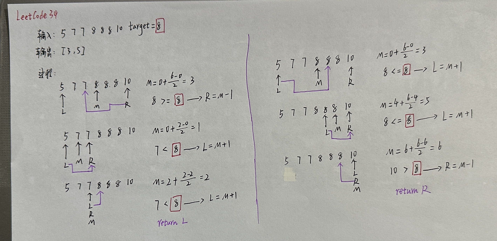
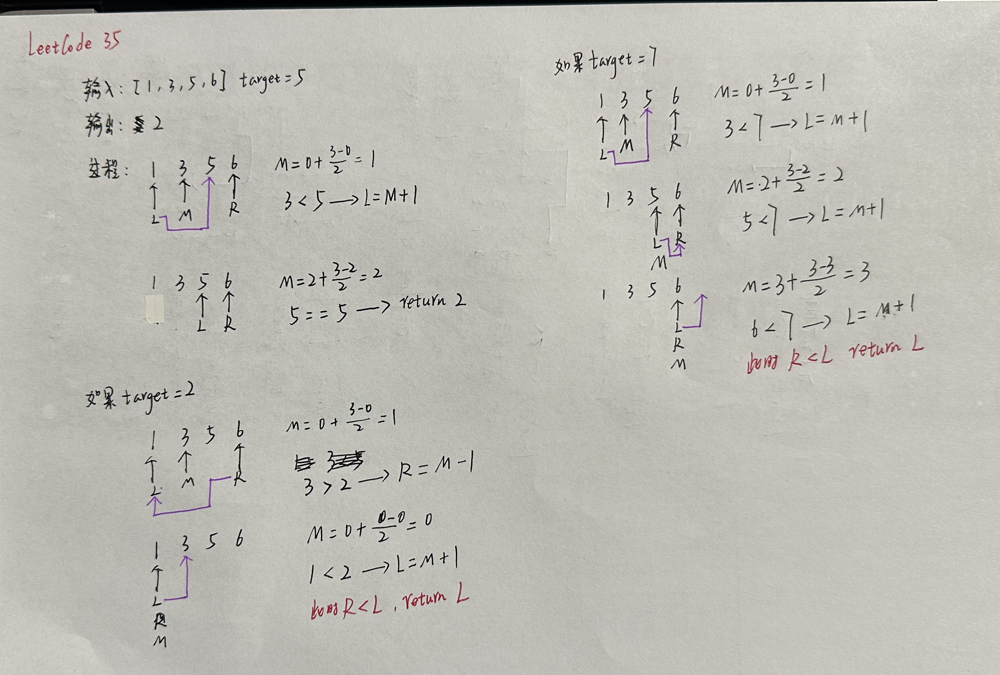
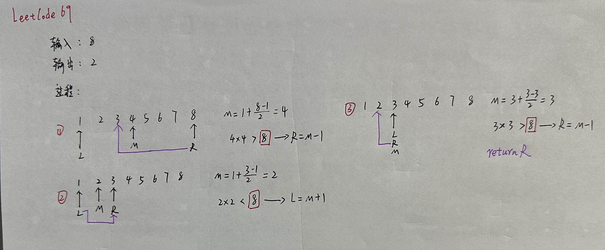
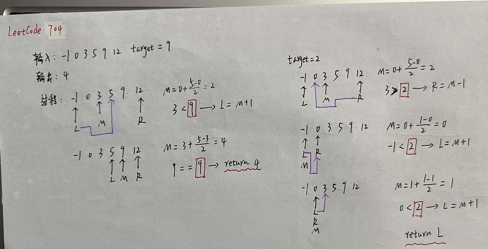
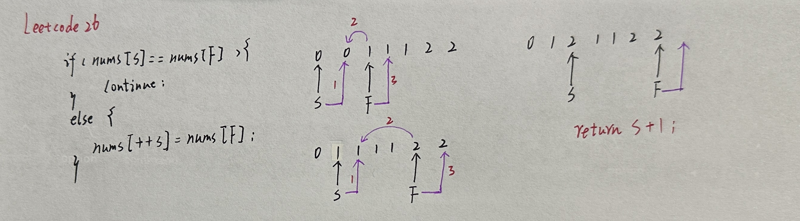
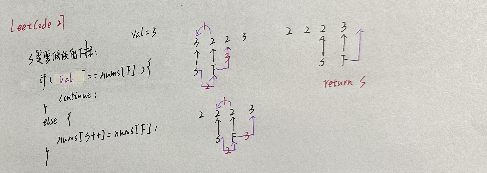
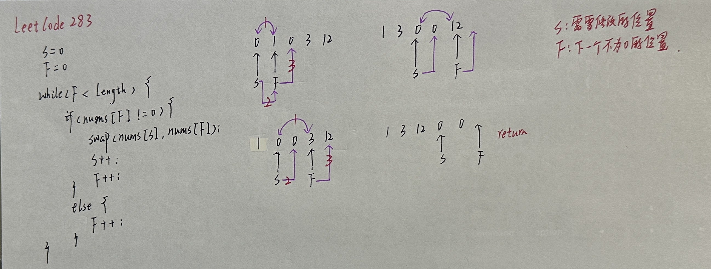
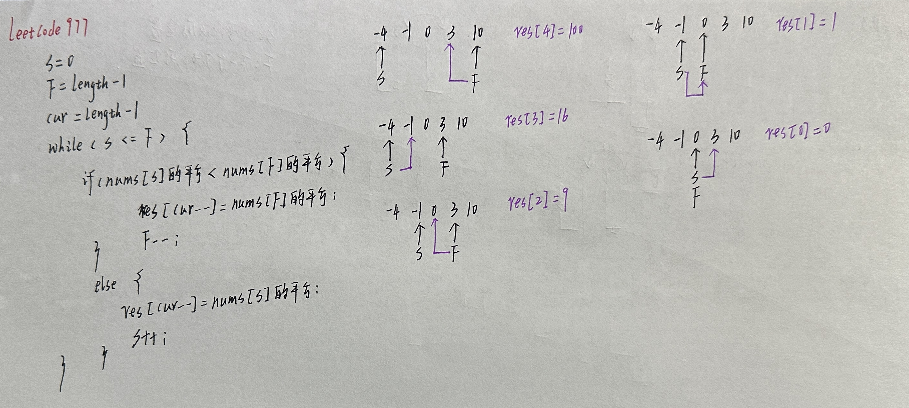
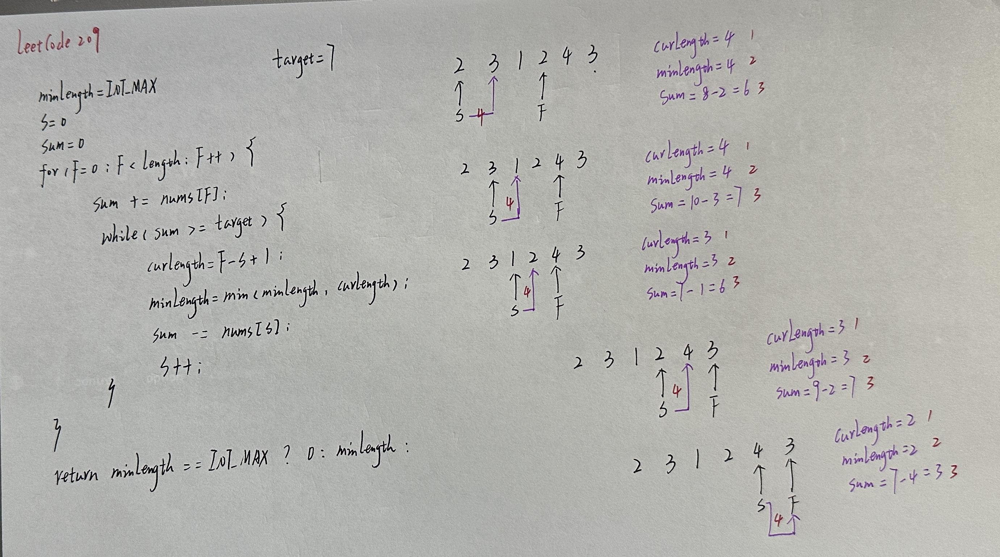

# 数组

## 二分查找

### 34

 

+ LeetCode34.cpp

### 35

 

+ LeetCode35.cpp

### 69

 

+ LeetCode69.cpp

### 367

+ LeetCode367.cpp

### 704

  

+ LeetCode704.cpp

## 移除元素

### 26 

 

+ LeetCode26.cpp

### 27

  

+ LeetCode27.cpp

### 283

 

+ LeetCode283.cpp

### 844

+ LeetCode844.cpp

### 977

 

+ LeetCode977.cpp

## 长度最小的子数组

### 76

+ LeetCode76.cpp

### 209

 

+ LeetCode209.cpp

### 904

+ LeetCode904.cpp

## 螺旋矩阵

### 54

+ LeetCode54.cpp

### 59

+ LeetCode59.cpp

