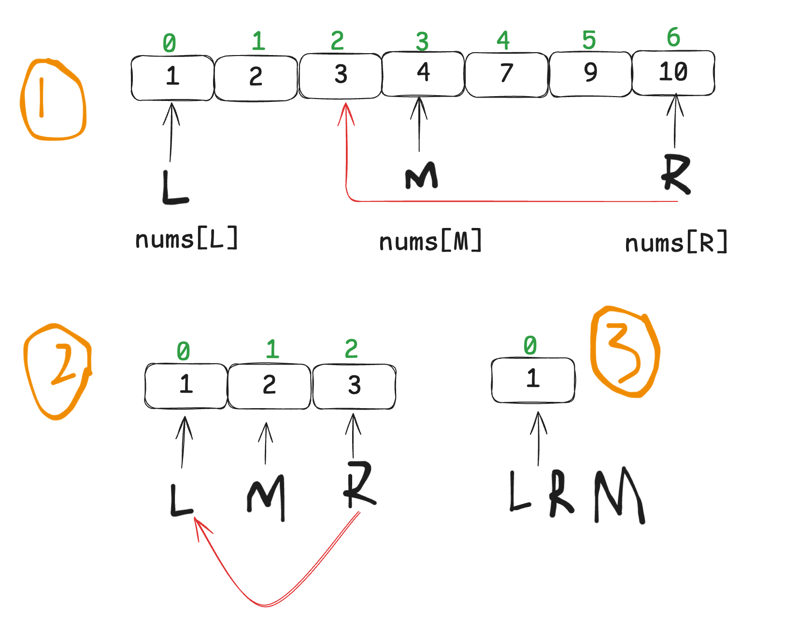
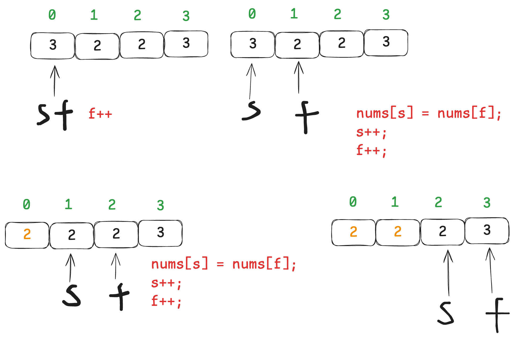
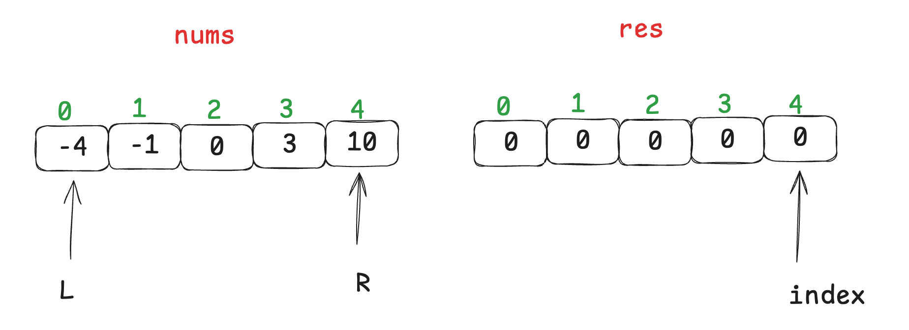
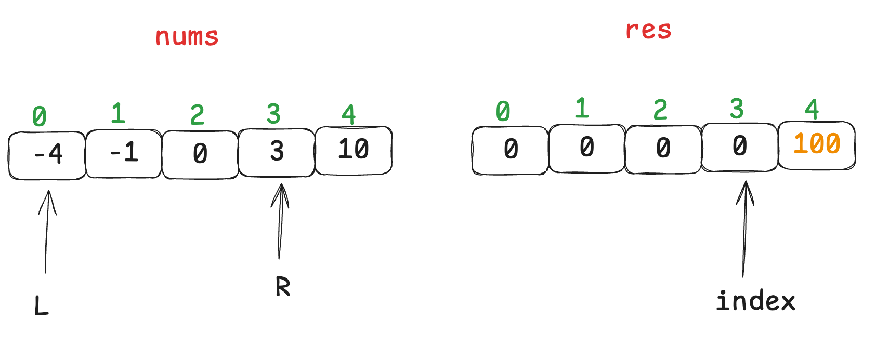
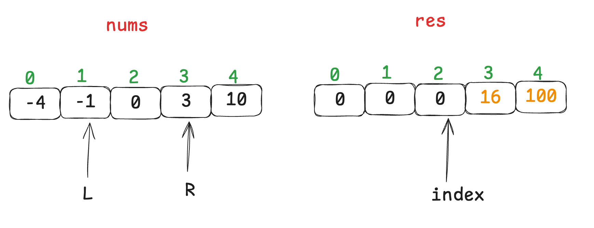
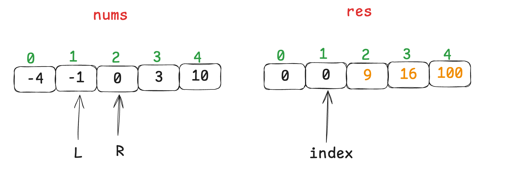
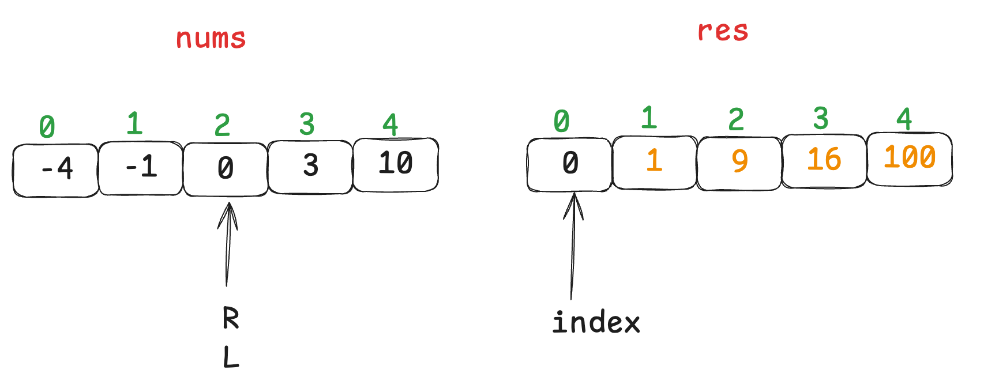
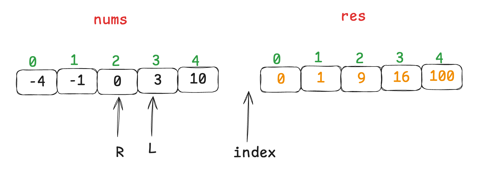
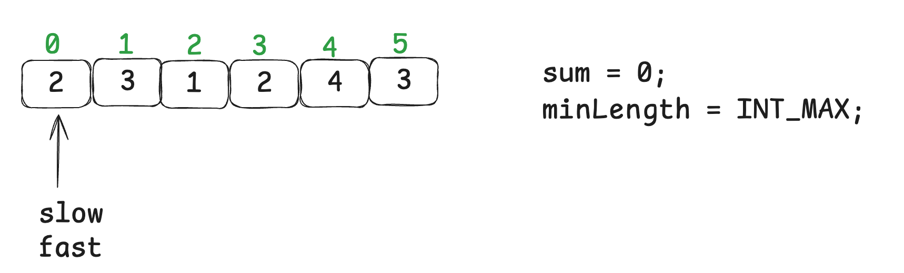
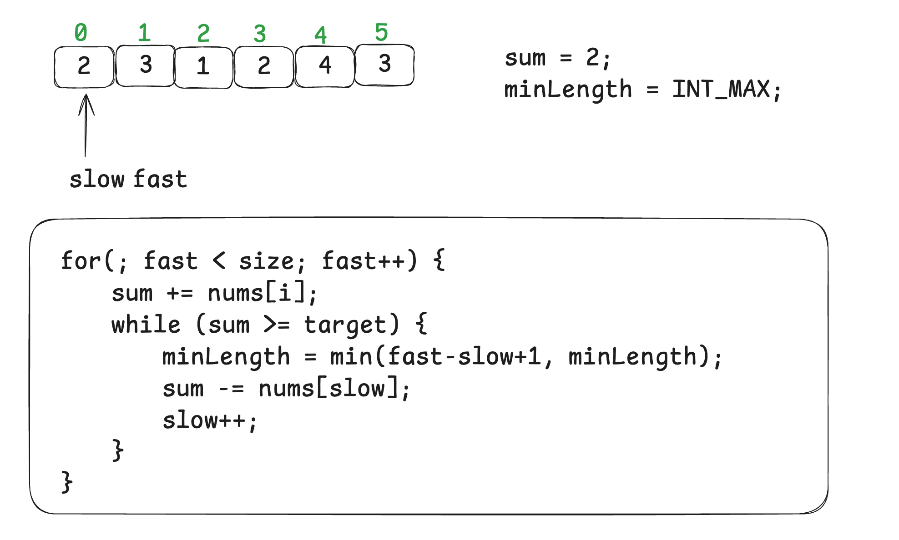

# 数组题目

## [704. 二分查找](https://leetcode.cn/problems/binary-search/)

 

+ 左闭右闭

```c++
class Solution {
public:
    int search(vector<int>& nums, int target) {
        int left = 0;
        int right = nums.size() - 1;
        while (left <= right) {
            int mid = left + (right - left) / 2;
            if (nums[mid] > target) {
                right--;
            }
            else if (nums[mid] < target) {
                left++;
            }
            else {
                return mid;
            }
        }
        return -1;
    }
};
```

+ 左闭右开

```c++
class Solution {
public:
    int search(vector<int>& nums, int target) {
        int left = 0;
        int right = nums.size();
        while (left < right) {
            int mid = left + (right - left) / 2;
            if (nums[mid] > target) {
                right--;
            }
            else if (nums[mid] < target) {
                left++;
            }
            else {
                return mid;
            }
        }
        return -1;
    }
};
```

**扩展：**

+ 35.搜索插入位置

+ 34.在排序数组中查找元素的第一个和最后一个位置

## [27. 移除元素](https://leetcode.cn/problems/remove-element/)

 

+ 双指针

```c++
class Solution {
public:
    int removeElement(vector<int>& nums, int val) {
        int slow = 0;
        int fast = 0;
        for(; fast < nums.size(); fast++) {
            if (nums[fast] != val) {
                nums[slow++] = nums[fast];
            }
        }
        return slow;
    }
};
```

+ 暴力

```c++
class Solution {
public:
    int removeElement(vector<int>& nums, int val) {
        int size = nums.size();
        for (int i = 0; i < size; i++) {
            if (nums[i] == val) {
                for (int j = i + 1; j < size; j++) {
                    nums[j - 1] = nums[j];
                }
                i--;
                size--;
            }
        }
        return size;
    }
};
```

## [977. 有序数组的平方](https://leetcode.cn/problems/squares-of-a-sorted-array/)

 

 

 

 

 

 

+ 双指针

```c++
class Solution {
public:
    vector<int> sortedSquares(vector<int>& nums) {
        int left = 0;
        int right = nums.size() - 1;
        int index = nums.size() - 1;
        vector<int> res(nums.size(), 0);
        while (left <= right) {
            long long leftValue = (long long)nums[left] * nums[left];
            long long rightValue = (long long)nums[right] * nums[right];
            if (leftValue < rightValue) {
                res[index--] = rightValue;
                right--;
            }
            else {
                res[index--] = leftValue;
                left++;
            }
        }
        return res;
    }
};
```

+ 暴力

```c++
class Solution {
public:
    vector<int> sortedSquares(vector<int>& nums) {
        for (int i = 0; i < nums.size(); i++) {
            nums[i] *= nums[i];
        }
        sort(nums.begin(), nums.end());
        return nums;
    }
};
```

扩展sort的用法：

```c++
#include <iostream>
#include <vector>
#include <algorithm>

bool compare(int a, int b) {
    return a > b; // 从大到小排序
}

int main() {
    std::vector<int> nums = {4, 1, 3, 5, 2};

    std::sort(nums.begin(), nums.end(), compare);

    for (int num : nums) {
        std::cout << num << " ";
    }
    return 0;
}
```

```c++
#include <iostream>
#include <vector>
#include <algorithm>
#include <functional>

int main() {
    std::vector<int> nums = {4, 1, 3, 5, 2};

    std::sort(nums.begin(), nums.end(), std::greater<int>());

    for (int num : nums) {
        std::cout << num << " ";
    }
    return 0;
}
```

## [209. 长度最小的子数组](https://leetcode.cn/problems/minimum-size-subarray-sum/)

初始化：

 

开始循环：

 

+ 双指针+滑动窗口

```c++
class Solution {
public:
    int minSubArrayLen(int target, vector<int>& nums) {
        int slow = 0;
        int fast = 0;
        int sum = 0;
        int minLength = INT_MAX;
        int size = nums.size();
        for (; fast < size; fast++) {
            sum += nums[fast];
            while (sum >= target) {
                minLength = minLength > fast - slow + 1 ? fast - slow + 1 : minLength;
                sum -= nums[slow++];
            }
        }
        return minLength == INT_MAX ? 0 : minLength;
    }
};
```

## [59. 螺旋矩阵 II](https://leetcode.cn/problems/spiral-matrix-ii/)

```c++
class Solution {
public:
    vector<vector<int>> generateMatrix(int n) {
        int startX = 0;
        int startY = 0;
        int loop = n / 2;
        int offset = 1;
        int count = 1;
        int mid = n / 2;
        int i;
        int j;
        vector<vector<int>> res(n, vector<int>(n, 0));
        while (loop--) {
            i = startX;
            j = startY;
            for (; j < n - offset; j++) {
                res[i][j] = count++;
            }
            for (; i < n - offset; i++) {
                res[i][j] = count++;
            }
            for (; j > startY; j--) {
                res[i][j] = count++;
            }
            for (; i > startX; i--) {
                res[i][j] = count++;
            }
            startX++;
            startY++;
            offset++;
        }
        if (n % 2) {
            res[mid][mid] = count++;
        }
        return res;
    }
};
```

## [区间和](https://www.programmercarl.com/kamacoder/0058.%E5%8C%BA%E9%97%B4%E5%92%8C.html#%E6%80%9D%E8%B7%AF)

+ 第一感觉

```c++
#include <iostream>
#include <vector>
using namespace std;

int main()
{
  int n;
  cin >> n;
  vector<int> res(n, 0);
  for (int i = 0; i < n; i++)
  {
    cin >> res[i];
  }
  int a;
  int b;
  while (cin >> a >> b)
  {
    int sum = 0;
    for (int i = a; i <= b; i++)
    {
      sum += res[i];
    }
    cout << sum << endl;
  }
}
```

会超时，因为如果每次我们都输入0 n，那么每次都得全部累加，十分耗时。

+ 改进，使用前缀和。

```c++
#include <iostream>
#include <vector>
using namespace std;

int main()
{
  int n;
  cin >> n;
  vector<int> res(n, 0);
  vector<int> pre(n, 0);
  int preSum = 0;
  for (int i = 0; i < n; i++)
  {
    cin >> res[i];
    preSum += res[i];
    pre[i] = preSum;
  }
  int a;
  int b;
  while (cin >> a >> b)
  {
    int sum = 0;
    if (a == 0)
    {
      sum = pre[b];
    }
    else
    {
      sum = pre[b] - pre[a - 1];
    }
    cout << sum << endl;
  }
}
```

+ 改进，使用scanf和printf。

```c++
#include <iostream>
#include <vector>
using namespace std;

int main()
{
  int n;
  cin >> n;
  vector<int> res(n, 0);
  vector<int> pre(n, 0);
  int preSum = 0;
  for (int i = 0; i < n; i++)
  {
    scanf("%d", &res[i]);
    preSum += res[i];
    pre[i] = preSum;
  }
  int a;
  int b;
  while (cin >> a >> b)
  {
    int sum = 0;
    if (a == 0)
    {
      sum = pre[b];
    }
    else
    {
      sum = pre[b] - pre[a - 1];
    }
    printf("%d\n", sum);
  }
}
```

