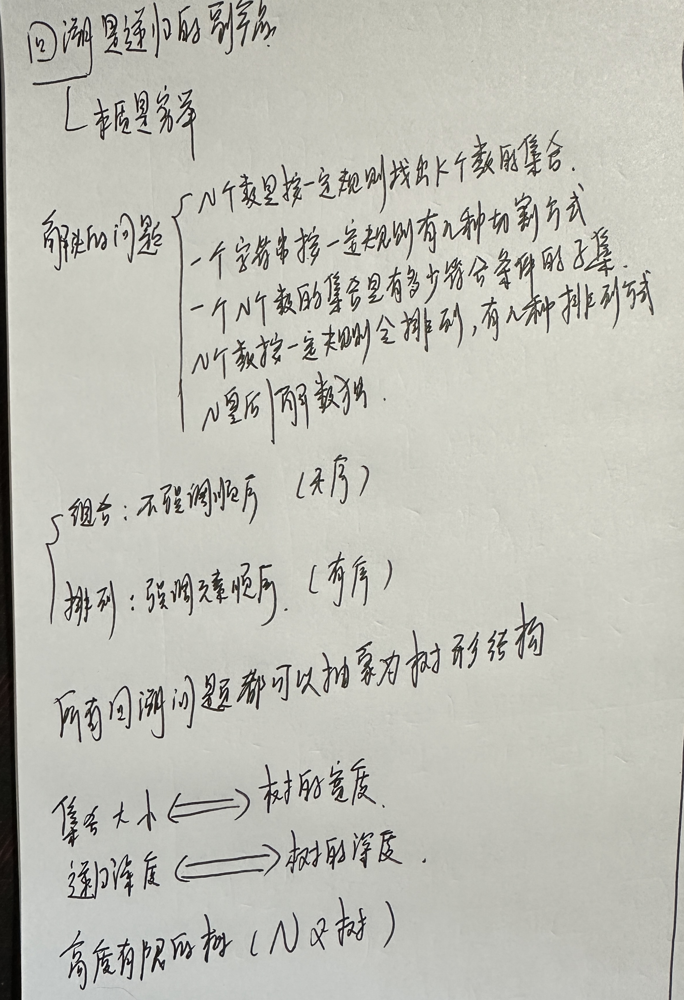
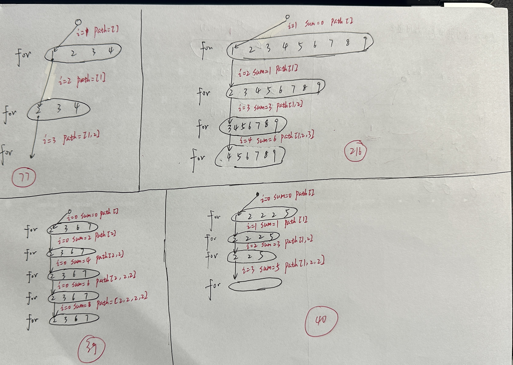
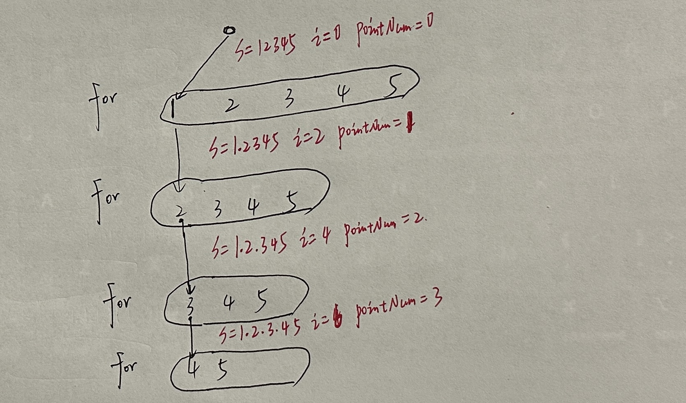
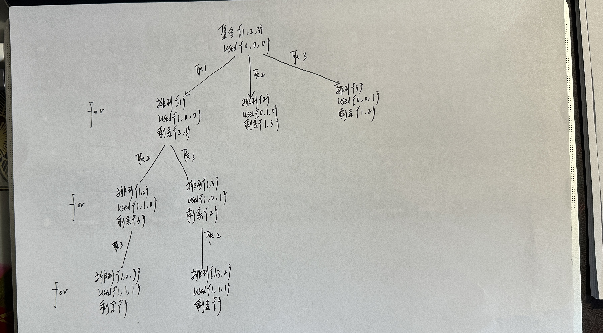
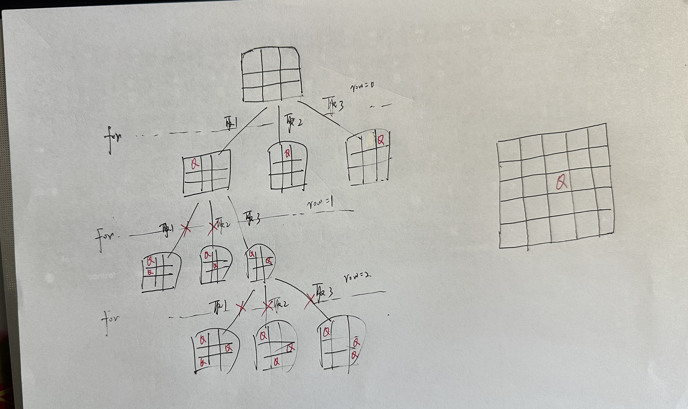

# 回溯

## 引入

代码模版：

```c++
void backtracking(参数) {
    if (终止条件) {
        存放结果;
        return;
    }

    for (选择：本层集合中元素（树中节点孩子的数量就是集合的大小）) {
        处理节点;
        backtracking(路径，选择列表); // 递归
        回溯，撤销处理结果
    }
}
```

基础知识：

 

## 组合

 

（1）组合

[LeetCode77.cpp](https://github.com/niu0217/Documents/blob/main/Algorithm/BackTracking/LeetCode77.cpp) 

（2）电话号码的字母组合

[LeetCode17.cpp](https://github.com/niu0217/Documents/blob/main/Algorithm/BackTracking/LeetCode17.cpp)

（3）组合总和

[LeetCode39.cpp](https://github.com/niu0217/Documents/blob/main/Algorithm/BackTracking/LeetCode39.cpp)

（4）组合总和II

[LeetCode40.cpp](https://github.com/niu0217/Documents/blob/main/Algorithm/BackTracking/LeetCode40.cpp)

（5）组合总和III

[LeetCode216.cpp](https://github.com/niu0217/Documents/blob/main/Algorithm/BackTracking/LeetCode216.cpp)

## 分割

（1）分割回文串

[LeetCode131.cpp](https://github.com/niu0217/Documents/blob/main/Algorithm/BackTracking/LeetCode131.cpp)

 

（2）复原IP地址

[LeetCode93.cpp](https://github.com/niu0217/Documents/blob/main/Algorithm/BackTracking/LeetCode93.cpp)

 

## 子集

（1）子集

[LeetCode78.cpp](https://github.com/niu0217/Documents/blob/main/Algorithm/BackTracking/LeetCode78.cpp)

（2）子集II

[LeetCode90.cpp](https://github.com/niu0217/Documents/blob/main/Algorithm/BackTracking/LeetCode90.cpp)

## 排列

（1）全排列

[LeetCode46.cpp](https://github.com/niu0217/Documents/blob/main/Algorithm/BackTracking/LeetCode46.cpp)

 

（2）全排列II

[LeetCode47.cpp](https://github.com/niu0217/Documents/blob/main/Algorithm/BackTracking/LeetCode47.cpp)

 

## 棋盘问题

（1）N皇后

[LeetCode51.cpp](https://github.com/niu0217/Documents/blob/main/Algorithm/BackTracking/LeetCode51.cpp)

 

（2）解数独

[LeetCode37.cpp](https://github.com/niu0217/Documents/blob/main/Algorithm/BackTracking/LeetCode37.cpp)

 

## 其他

（1）递增子序列

（2）重新安排行程