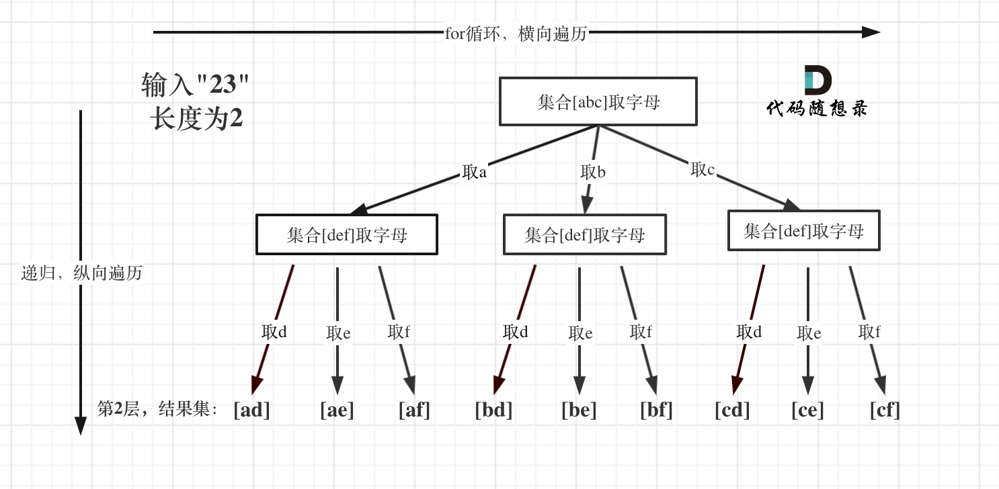

# 回溯算法Days1

## [77. 组合](https://leetcode.cn/problems/combinations/)

 

+ 简单回溯：

```c++
class Solution {
public:
    vector<vector<int>> allPath;
    vector<int> path;
    void backtracking(int n, int k, int startIndex) {
        if (path.size() == k) {
            allPath.push_back(path);
            return;
        }
        for (int i = startIndex; i <= n; i++) {
            path.push_back(i);
            backtracking(n, k, i + 1);
            path.pop_back();
        }
    }
    vector<vector<int>> combine(int n, int k) {
        backtracking(n, k, 1);
        return allPath;
    }
};
```

+ 回溯 + 剪枝

```c++
class Solution {
public:
    vector<vector<int>> allPath;
    vector<int> path;
    void backtracking(int n, int k, int startIndex) {
        if (path.size() == k) {
            allPath.push_back(path);
            return;
        }
        for (int i = startIndex; i <= n - (k - path.size()) + 1; i++) {
            path.push_back(i);
            backtracking(n, k, i + 1);
            path.pop_back();
        }
    }
    vector<vector<int>> combine(int n, int k) {
        backtracking(n, k, 1);
        return allPath;
    }
};
```

## [216. 组合总和 III](https://leetcode.cn/problems/combination-sum-iii/)

 

+ 不带剪枝：

```c++
class Solution {
public:
    vector<vector<int>> result;
    vector<int> path;
    void backtracking(int k, int n, int startIndex, int sum) {
        if (path.size() == k) {
            if (sum == n) {
                result.push_back(path);
            }
            return;
        }
        for (int i = startIndex; i <= 9; i++) {
            sum += i;
            path.push_back(i);
            backtracking(k, n, i + 1, sum);
            path.pop_back();
            sum -= i;
        }
    }
    vector<vector<int>> combinationSum3(int k, int n) {
        backtracking(k, n, 1, 0);
        return result;
    }
};
```

+ 带剪枝：

```c++
class Solution {
public:
    vector<vector<int>> result;
    vector<int> path;
    void backtracking(int k, int n, int startIndex, int sum) {
        if (path.size() == k) {
            if (sum == n) {
                result.push_back(path);
            }
            return;
        }
        for (int i = startIndex; i <= 9 && sum + i <= n; i++) {
            sum += i;
            path.push_back(i);
            backtracking(k, n, i + 1, sum);
            path.pop_back();
            sum -= i;
        }
    }
    vector<vector<int>> combinationSum3(int k, int n) {
        backtracking(k, n, 1, 0);
        return result;
    }
};
```

## [17. 电话号码的字母组合](https://leetcode.cn/problems/letter-combinations-of-a-phone-number/)

 

```c++
class Solution {
private:
    const string digitsMap[10] = {
        "",
        "",
        "abc",
        "def",
        "ghi",
        "jkl",
        "mno",
        "pqrs",
        "tuv",
        "wxyz"
    };

public:
    vector<string> result;
    string s;
    void backtracking(const string &digits, int index) {
        if (index == digits.size()) {
            result.push_back(s);
            return;
        }
        int number = digits[index] - '0';
        string letter = digitsMap[number];
        for (int i = 0; i < letter.size(); i++) {
            s.push_back(letter[i]);
            backtracking(digits, index + 1);
            s.pop_back();
        }
    }
    vector<string> letterCombinations(string digits) {
        if (digits.size() == 0) {
            return {};
        }
        backtracking(digits, 0);
        return result;
    }
};
```

