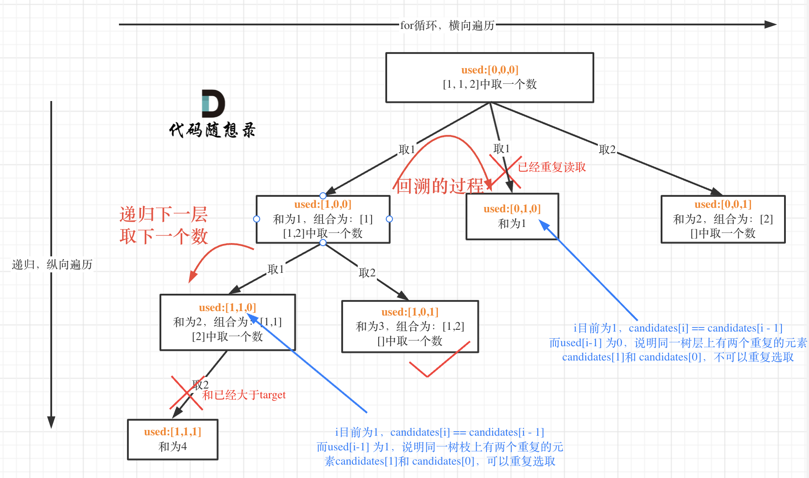

# 回溯算法Days2

## [39. 组合总和](https://leetcode.cn/problems/combination-sum/)

 

+ 回溯

```c++
class Solution {
public:
    vector<vector<int>> result;
    vector<int> path;
    void backtracking(vector<int> &candidates, int target, int sum, int index) {
        if (sum > target) {
            return;
        }
        if (sum == target) {
            result.push_back(path);
            return;
        }
        for (int i = index; i < candidates.size(); i++) {
            sum += candidates[i];
            path.push_back(candidates[i]);
            backtracking(candidates, target, sum, i);
            path.pop_back();
            sum -= candidates[i];
        }
    }
    vector<vector<int>> combinationSum(vector<int>& candidates, int target) {
        if (candidates.size() == 0) {
            return {};
        }
        backtracking(candidates, target, 0, 0);
        return result;
    }
};
```

+ 回溯 + 剪枝

```c++
class Solution {
public:
    vector<vector<int>> result;
    vector<int> path;
    void backtracking(vector<int> &candidates, int target, int sum, int index) {
        if (sum == target) {
            result.push_back(path);
            return;
        }
        for (int i = index; i < candidates.size() && candidates[i] + sum <= target; i++) {
            sum += candidates[i];
            path.push_back(candidates[i]);
            backtracking(candidates, target, sum, i);
            path.pop_back();
            sum -= candidates[i];
        }
    }
    vector<vector<int>> combinationSum(vector<int>& candidates, int target) {
        if (candidates.size() == 0) {
            return {};
        }
        sort(candidates.begin(), candidates.end());
        backtracking(candidates, target, 0, 0);
        return result;
    }
};
```

## [40. 组合总和 II](https://leetcode.cn/problems/combination-sum-ii/)

 

```c++
class Solution {
public:
    vector<vector<int>> result;
    vector<int> path;
    void backtracking(vector<int> &candidates, int target, int index, int sum, vector<bool> &used) {
        if (sum == target) {
            result.push_back(path);
            return;
        }
        for (int i = index; i < candidates.size() && sum + candidates[i] <= target; i++) {
            if (i > 0 && candidates[i] == candidates[i - 1] && used[i - 1] == false) {
                continue;
            }
            sum += candidates[i];
            path.push_back(candidates[i]);
            used[i] = true;
            backtracking(candidates, target, i + 1, sum, used);
            used[i] = false;
            path.pop_back();
            sum -= candidates[i];
        }
    }
    vector<vector<int>> combinationSum2(vector<int>& candidates, int target) {
        if (candidates.size() == 0) {
            return {};
        }
        sort(candidates.begin(), candidates.end());
        vector<bool> used(candidates.size(), false);
        backtracking(candidates, target, 0, 0, used);
        return result;
    }
};
```

## [131. 分割回文串](https://leetcode.cn/problems/palindrome-partitioning/)

 

```c++
class Solution {
public:
    bool isPalindrome(const string &s, int i, int j) {
        while (i <= j) {
            if (s[i] == s[j]) {
                i++;
                j--;
            }
            else {
                return false;
            }
        }
        return true;
    }
public:
    vector<vector<string>> result;
    vector<string> path;
    void backtracking(string &s, int startIndex) {
        if (startIndex >= s.size()) {
            result.push_back(path);
            return;
        }
        for (int i = startIndex; i < s.size(); i++) {
            if (isPalindrome(s, startIndex, i)) {
                string str = s.substr(startIndex, i - startIndex + 1);
                path.push_back(str);
            }
            else {
                continue;
            }
            backtracking(s, i + 1);
            path.pop_back();
        }
    }
    vector<vector<string>> partition(string s) {
        if (s.size() == 0) {
            return {};
        }
        backtracking(s, 0);
        return result;
    }
};
```

