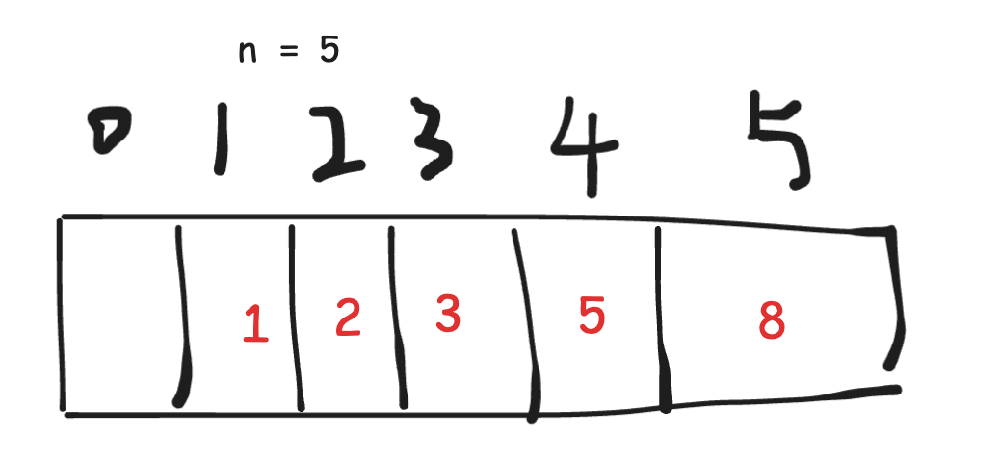
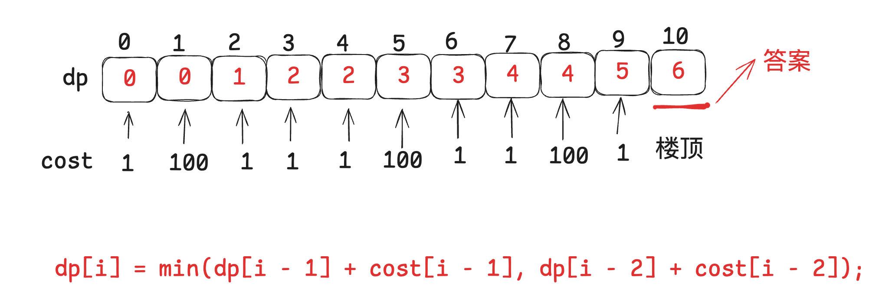

# 动态规划Days1

## [509. 斐波那契数](https://leetcode.cn/problems/fibonacci-number/)

**简单题目是用来加深对解题方法论的理解的**。

用一个一维dp数组来保存递归的结果。


**步骤一：确定dp数组以及下标的含义**

dp[i]的定义为：第i个数的斐波那契数值是dp[i]。

**步骤二：确定递推公式**

状态转移方程 `dp[i] = dp[i - 1] + dp[i - 2];`

**步骤三：dp数组如何初始化**

```
dp[0] = 0;
dp[1] = 1;
```

**步骤四：确定遍历顺序**

dp[i]是依赖 dp[i - 1] 和 dp[i - 2]，那么遍历的顺序一定是从前到后遍历的。

**步骤五：举例推导dp数组**

N = 10的时候，`0 1 1 2 3 5 8 13 21 34 55`

```c++
class Solution {
public:
    int fib(int n) {
        if (n <= 1) {
            return n;
        }
        int dp[2];
        dp[0] = 0;
        dp[1] = 1;
        for (int i = 2; i <= n; i++) {
            int sum = dp[0] + dp[1];
            dp[0] = dp[1];
            dp[1] = sum;
        }
        return dp[1];
    }
};
```


## [70. 爬楼梯](https://leetcode.cn/problems/climbing-stairs/)

**步骤一：确定dp数组以及下标的含义**

dp[i] 表示爬到 i 阶楼梯有 dp[i] 种方式。

**步骤二：确定递推公式**

从dp[i]的定义可以看出，dp[i] 可以有两个方向推出来。

首先是dp[i - 1]，上 i-1 层楼梯，有dp[i - 1]种方法，那么再一步跳一个台阶不就是dp[i]了么。

还有就是dp[i - 2]，上 i-2 层楼梯，有dp[i - 2]种方法，那么再一步跳两个台阶不就是dp[i]了么。

那么dp[i]就是 dp[i - 1]与dp[i - 2]之和！

所以dp[i] = dp[i - 1] + dp[i - 2] 。

**步骤三：dp数组如何初始化**

```
dp[1] = 1;
dp[2] = 2;
dp[3] = 
```

**步骤四：确定遍历顺序**

一定是从前往后，递推公式确定的。

**步骤五：举例推导dp数组**

 

代码：

```c++
class Solution {
public:
    int climbStairs(int n) {
        if (n <= 2) {
            return n;
        }
        vector<int> dp(n + 1, 0);
        dp[1] = 1;
        dp[2] = 2;
        for (int i = 3; i <= n; i++) {
            dp[i] = dp[i - 1] + dp[i - 2];
        }
        return dp[n];
    }
};
```


## [746. 使用最小花费爬楼梯](https://leetcode.cn/problems/min-cost-climbing-stairs/)

**步骤一：确定dp数组以及下标的含义**

dp[i]的定义：到达第i台阶所花费的最少体力为dp[i]。

**步骤二：确定递推公式**

可以有两个途径得到dp[i]，一个是dp[i-1] 一个是dp[i-2]。

dp[i - 1] 跳到 dp[i] 需要花费 dp[i - 1] + cost[i - 1]。

dp[i - 2] 跳到 dp[i] 需要花费 dp[i - 2] + cost[i - 2]。

那么究竟是选从dp[i - 1]跳还是从dp[i - 2]跳呢？

一定是选最小的，所以`dp[i] = min(dp[i - 1] + cost[i - 1], dp[i - 2] + cost[i - 2]);`

**步骤三：dp数组如何初始化**

```
dp[0] = 0;
dp[1] = 0;
```

**步骤四：确定遍历顺序**

从前往后。

**步骤五：举例推导dp数组**

 

```c++
class Solution {
public:
    int minCostClimbingStairs(vector<int>& cost) {
        vector<int> dp(cost.size() + 1, 0);
        dp[0] = 0;
        dp[1] = 0;
        for (int i = 2; i <= cost.size(); i++) {
            dp[i] = min(dp[i - 1] + cost[i - 1], dp[i - 2] + cost[i - 2]);
        }
        return dp[cost.size()];
    }
};
```

