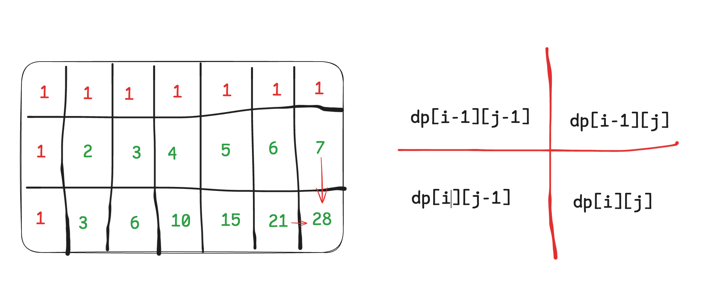
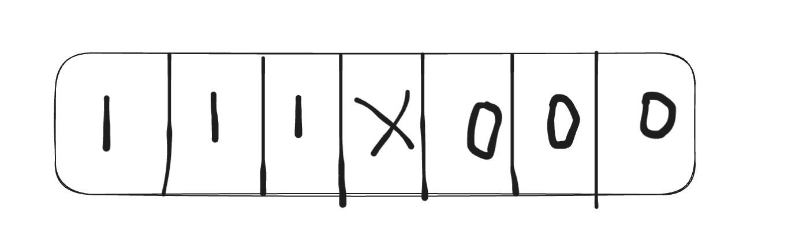
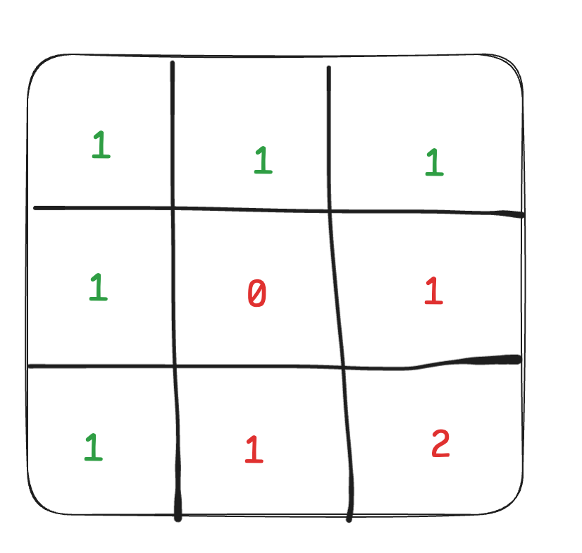

# 动态规划Days2

## [62. 不同路径](https://leetcode.cn/problems/unique-paths/)

**步骤一：确定dp数组以及下标的含义**

`dp[i][j] ：表示从（0 ，0）出发，到(i, j) 有dp[i][j]条不同的路径。`

**步骤二：确定递推公式**

```
想要求dp[i][j]，只能有两个方向来推导出来，即dp[i - 1][j] 和 dp[i][j - 1]。

此时在回顾一下 dp[i - 1][j] 表示啥，是从(0, 0)的位置到(i - 1, j)有几条路径，dp[i][j - 1]同理。

那么很自然，dp[i][j] = dp[i - 1][j] + dp[i][j - 1]，因为dp[i][j]只有这两个方向过来。
```

**步骤三：dp数组如何初始化**

```
如何初始化呢，首先dp[i][0]一定都是1，因为从(0, 0)的位置到(i, 0)的路径只有一条，那么dp[0][j]也同理。
```

**步骤四：确定遍历顺序**

```
这里要看一下递推公式dp[i][j] = dp[i - 1][j] + dp[i][j - 1]，dp[i][j]都是从其上方和左方推导而来，那么从左到右一层一层遍历就可以了。

这样就可以保证推导dp[i][j]的时候，dp[i - 1][j] 和 dp[i][j - 1]一定是有数值的。
```

**步骤五：举例推导dp数组**

 

```c++
class Solution {
public:
    int uniquePaths(int m, int n) {
        vector<vector<int>> dp(m, vector<int>(n, 0));
        for (int i = 0; i < m; i++) {
            dp[i][0] = 1;
        }
        for (int j = 0; j < n; j++) {
            dp[0][j] = 1;
        }
        for (int i = 1; i < m; i++) {
            for (int j = 1; j < n; j++) {
                dp[i][j] = dp[i - 1][j] + dp[i][j - 1];
            }
        }
        return dp[m - 1][n - 1];
    }
};
```

## [63. 不同路径 II](https://leetcode.cn/problems/unique-paths-ii/)

**步骤一：确定dp数组以及下标的含义**

`dp[i][j] ：表示从（0 ，0）出发，到(i, j) 有dp[i][j]条不同的路径。`

**步骤二：确定递推公式**

```
dp[i][j] = dp[i - 1][j] + dp[i][j - 1]
```

对应代码的话：

```c++
if (obstacleGrid[i][j] == 0) { // 当(i, j)没有障碍的时候，再推导dp[i][j]
    dp[i][j] = dp[i - 1][j] + dp[i][j - 1];
}
```

**步骤三：dp数组如何初始化**

 

**步骤四：确定遍历顺序**

```
从递归公式dp[i][j] = dp[i - 1][j] + dp[i][j - 1] 中可以看出，一定是从左到右一层一层遍历，这样保证推导dp[i][j]的时候，dp[i - 1][j] 和 dp[i][j - 1]一定是有数值。
```

**步骤五：举例推导dp数组**

 

```c++
class Solution {
public:
    int uniquePathsWithObstacles(vector<vector<int>>& obstacleGrid) {
        int m = obstacleGrid.size();
        int n = obstacleGrid[0].size();

        // 起点和终点有障碍
        if (obstacleGrid[0][0] == 1 || obstacleGrid[m - 1][n - 1] == 1) {
            return 0;
        }

        vector<vector<int>> dp(m, vector<int>(n, 0));
        for (int i = 0; i < m && obstacleGrid[i][0] == 0; i++) {
            dp[i][0] = 1;
        }
        for (int j = 0; j < n && obstacleGrid[0][j] == 0; j++) {
            dp[0][j] = 1;
        }
        for (int i = 1; i < m; i++) {
            for (int j = 1; j < n; j++) {
                if (obstacleGrid[i][j] == 1) {
                    continue;
                }
                dp[i][j] = dp[i - 1][j] + dp[i][j - 1];
            }
        }
        return dp[m - 1][n - 1];
    }
};
```

