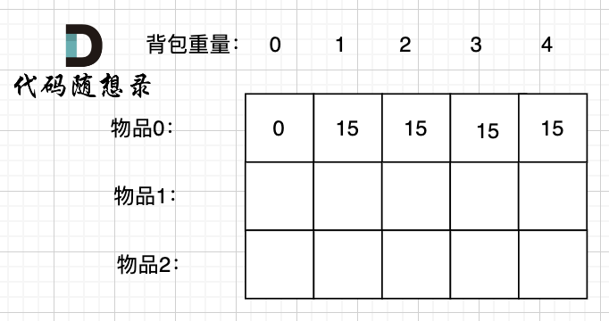
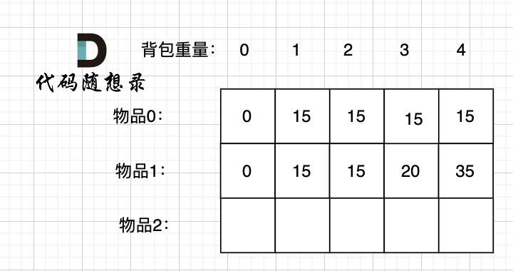
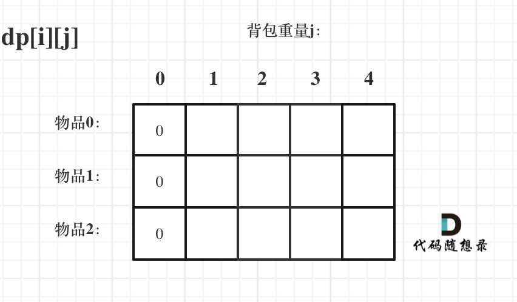

# 动态规划Days3

## 背包地图

 

## 01背包

有n件物品和一个最多能背重量为w 的背包。第i件物品的重量是weight[i]，得到的价值是value[i] 。**每件物品只能用一次**，求解将哪些物品装入背包里物品价值总和最大。

 

在下面的讲解中，我举一个例子：

背包最大重量为4。

物品为：

| 物品  | 重量 | 价值 |
| ----- | ---- | ---- |
| 物品0 | 1    | 15   |
| 物品1 | 3    | 20   |
| 物品2 | 4    | 30   |

问背包能背的物品最大价值是多少？

###  二维dp数组01背包

**步骤一：确定dp数组以及下标的含义**

 

+ i 来表示物品；
+ j表示背包容量；

`dp[i][j] 表示从下标为[0-i]的物品里任意取，放进容量为j的背包，价值总和最大是多少`

讨论把物品0 放入背包的情况：

 

背包容量为0，放不下物品0，此时背包里的价值为0。

背包容量为1，可以放下物品0，此时背包里的价值为15.

背包容量为2，依然可以放下物品0 （注意 01背包里物品只有一个），此时背包里的价值为15。

以此类推。

讨论把物品1 放入背包的情况：

 

背包容量为 0，放不下物品0 或者物品1，此时背包里的价值为0。

背包容量为 1，只能放下物品0，背包里的价值为15。

背包容量为 2，只能放下物品0，背包里的价值为15。

背包容量为 3，上一行同一状态，背包只能放物品0，这次也可以选择物品1了，背包可以放物品1 或者 物品0，物品1价值更大，背包里的价值为20。

背包容量为 4，上一行同一状态，背包只能放物品0，这次也可以选择物品1了，背包可以放下物品0 和 物品1，背包价值为35。

` dp[1][4]: 任取 物品0，物品1 放进容量为4的背包里，最大价值是 dp[1][4]`

**步骤二：确定递推公式**

求取 `dp[1][4]` 有两种情况：

1. 放物品1
2. 还是不放物品1

如果不放物品1， 那么背包的价值应该是 `dp[0][4]` 即 容量为4的背包，只放物品0的情况。

推导方向如图：

 

如果放物品1， **那么背包要先留出物品1的容量**，目前容量是4，物品1 的容量（就是物品1的重量）为3，此时背包剩下容量为1。

容量为1，只考虑放物品0 的最大价值是 `dp[0][1]`，这个值我们之前就计算过。

所以 放物品1 的情况 = `dp[0][1] + 物品1 的价值`，推导方向如图：

 

两种情况，分别是放物品1 和 不放物品1，我们要取最大值（毕竟求的是最大价值）

```
dp[1][4] = max(dp[0][4], dp[0][1] + 物品1 的价值)
```

以上过程，抽象化如下：

- **不放物品i**：背包容量为j，里面不放物品i的最大价值是`dp[i - 1][j]`。
- **放物品i**：背包空出物品i的容量后，背包容量为j - weight[i]，`dp[i - 1][j - weight[i]]` 为背包容量为j - weight[i]且不放物品i的最大价值，那么`dp[i - 1][j - weight[i]] + value[i] （物品i的价值）`，就是背包放物品i得到的最大价值

递归公式： `dp[i][j] = max(dp[i - 1][j], dp[i - 1][j - weight[i]] + value[i]);`

**步骤三：dp数组如何初始化**

**关于初始化，一定要和dp数组的定义吻合，否则到递推公式的时候就会越来越乱**。

首先从`dp[i][j]`的定义出发，如果背包容量j为0的话，即`dp[i][0]`，无论是选取哪些物品，背包价值总和一定为0。如图：

 

在看其他情况。

状态转移方程 `dp[i][j] = max(dp[i - 1][j], dp[i - 1][j - weight[i]] + value[i]);` 可以看出i 是由 i-1 推导出来，那么i为0的时候就一定要初始化。

`dp[0][j]`，即：i为0，存放编号0的物品的时候，各个容量的背包所能存放的最大价值。

那么很明显当 `j < weight[0]`的时候，`dp[0][j]` 应该是 0，因为背包容量比编号0的物品重量还小。

当`j >= weight[0]`时，`dp[0][j]` 应该是value[0]，因为背包容量放足够放编号0物品。

```c++
for (int j = 0 ; j < weight[0]; j++) {
    dp[0][j] = 0;
}
// 正序遍历
for (int j = weight[0]; j <= bagweight; j++) {
    dp[0][j] = value[0];
}
```

 

整体初始化的样子：

 

**步骤四：确定遍历顺序**

两种都可以：

+ 先遍历物品，后遍历背包；

+ 先遍历背包，后遍历物品；

**步骤五：举例推导dp数组**

 

### 滚动数组01背包

**步骤一：确定dp数组以及下标的含义**

`在一维dp数组中，dp[j]表示：容量为j的背包，所背的物品价值可以最大为dp[j]。`

**步骤二：确定递推公式**

`dp[j] = max(dp[j], dp[j - weight[i]] + value[i])`

**步骤三：dp数组如何初始化**

dp[j]表示：容量为j的背包，所背的物品价值可以最大为dp[j]，那么dp[0]就应该是0，因为背包容量为0所背的物品的最大价值就是0。

那么dp数组除了下标0的位置，初始为0，其他下标应该初始化多少呢？

看一下递归公式：`dp[j] = max(dp[j], dp[j - weight[i]] + value[i]);`

dp数组在推导的时候一定是取价值最大的数，如果题目给的价值都是正整数那么非0下标都初始化为0就可以了。

**步骤四：确定遍历顺序**

```c++
for(int i = 0; i < weight.size(); i++) { // 遍历物品
    for(int j = bagWeight; j >= weight[i]; j--) { // 遍历背包容量
        dp[j] = max(dp[j], dp[j - weight[i]] + value[i]);
    }
}
```

**倒序遍历是为了保证物品i只被放入一次！**。但如果一旦正序遍历了，那么物品0就会被重复加入多次！

举一个例子：物品0的重量weight[0] = 1，价值value[0] = 15

如果正序遍历

dp[1] = dp[1 - weight[0]] + value[0] = 15

dp[2] = dp[2 - weight[0]] + value[0] = 30

此时dp[2]就已经是30了，意味着物品0，被放入了两次，所以不能正序遍历。

为什么倒序遍历，就可以保证物品只放入一次呢？

倒序就是先算dp[2]

dp[2] = dp[2 - weight[0]] + value[0] = 15 （dp数组已经都初始化为0）

dp[1] = dp[1 - weight[0]] + value[0] = 15

所以从后往前循环，每次取得状态不会和之前取得状态重合，这样每种物品就只取一次了。

一定是先物品，再背包。

**步骤五：举例推导dp数组**

 

## [46. 携带研究材料（第六期模拟笔试）](https://kamacoder.com/problempage.php?pid=1046)

+ 二维数组 + 先遍历物品，后遍历背包

```c++
#include <iostream>
#include <vector>
using namespace std;

int main()
{
    int itemQuantity;  // 物品数量
    int bagWeight;     // 背包的容量
    cin >> itemQuantity >> bagWeight;
    vector<int> weight(itemQuantity, 0);
    vector<int> value(itemQuantity, 0);
    for (int i = 0; i < itemQuantity; i++) {
        cin >> weight[i];
    }
    for (int i = 0; i < itemQuantity; i++) {
        cin >> value[i];
    }
    
    vector<vector<int>> dp(itemQuantity, vector<int>(bagWeight + 1, 0));
    for (int j = weight[0]; j <= bagWeight; j++) {
        dp[0][j] = value[0];
    }
    for (int i = 1; i < itemQuantity; i++) {
        for (int j = 1; j <= bagWeight; j++) {
            if (j < weight[i]) {
                dp[i][j] = dp[i - 1][j];
                continue;
            }
            dp[i][j] = max(dp[i - 1][j], dp[i - 1][j - weight[i]] + value[i]);
        }
    }
    cout << dp[itemQuantity - 1][bagWeight] << endl;
}
```

+ 二维数组 + 先遍历背包，后遍历物品

```c++
#include <iostream>
#include <vector>
using namespace std;

int main()
{
    int itemQuantity;  // 物品数量
    int bagWeight;     // 背包的容量
    cin >> itemQuantity >> bagWeight;
    vector<int> weight(itemQuantity, 0);
    vector<int> value(itemQuantity, 0);
    for (int i = 0; i < itemQuantity; i++) {
        cin >> weight[i];
    }
    for (int i = 0; i < itemQuantity; i++) {
        cin >> value[i];
    }
    
    vector<vector<int>> dp(itemQuantity, vector<int>(bagWeight + 1, 0));
    for (int j = weight[0]; j <= bagWeight; j++) {
        dp[0][j] = value[0];
    }
    for (int j = 0; j <= bagWeight; j++) {
        for (int i = 1; i < itemQuantity; i++) {
            if (j < weight[i]) {
                dp[i][j] = dp[i - 1][j];
                continue;
            }
            dp[i][j] = max(dp[i - 1][j], dp[i - 1][j - weight[i]] + value[i]);
        }
    }
    cout << dp[itemQuantity - 1][bagWeight] << endl;
}
```

+ 一维数组 + 先遍历物品，后遍历背包

```c++
#include <iostream>
#include <vector>
using namespace std;

int main()
{
    int itemQuantity;  // 物品数量
    int bagWeight;     // 背包的容量
    cin >> itemQuantity >> bagWeight;
    vector<int> weight(itemQuantity, 0);
    vector<int> value(itemQuantity, 0);
    for (int i = 0; i < itemQuantity; i++) {
        cin >> weight[i];
    }
    for (int i = 0; i < itemQuantity; i++) {
        cin >> value[i];
    }
    
    vector<int> dp(bagWeight + 1, 0);
    for (int i = 0; i < itemQuantity; i++) {
        for (int j = bagWeight; j >= weight[i]; j--) {
            dp[j] = max(dp[j], dp[j - weight[i]] + value[i]);
        }
    }
    cout << dp[bagWeight] << endl;
}
```

## [416. 分割等和子集](https://leetcode.cn/problems/partition-equal-subset-sum/)

首先，本题要求集合里能否出现总和为 sum / 2 的子集。

**只有确定了如下四点，才能把01背包问题套到本题上来。**

- 背包的体积为sum / 2
- 背包要放入的商品（集合里的元素）重量为 元素的数值，价值也为元素的数值
- 背包如果正好装满，说明找到了总和为 sum / 2 的子集。
- 背包中每一个元素是不可重复放入。


**步骤一：确定dp数组以及下标的含义**

dp[j]：容量为j的背包，所背的物品价值可以最大为dp[j]。

**步骤二：确定递推公式**

`dp[j] = max(dp[j], dp[j - weight[i]] + value[i])`		

**步骤三：dp数组如何初始化**

全部初始化为0。

**步骤四：确定遍历顺序**

先变量物品，后倒叙遍历背包。

**步骤五：举例推导dp数组**

 

```c++
class Solution {
public:
    bool canPartition(vector<int>& nums) {
        int sum = 0;
        for (int i = 0; i < nums.size(); i++) {
            sum += nums[i];
        }
        
        if (sum % 2 == 1) {
            return false;
        }

        int bagWeight = sum / 2;
        vector<int> dp(bagWeight + 1, 0);
        for (int i = 0; i < nums.size(); i++) {
            for (int j = bagWeight; j >= nums[i]; j--) {
                dp[j] = max(dp[j], dp[j - nums[i]] + nums[i]);
            }
        }

        if (dp[bagWeight] == bagWeight) {
            return true;
        }
        return false;
    }
};
```

