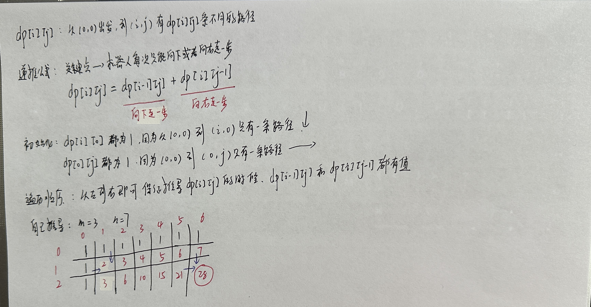
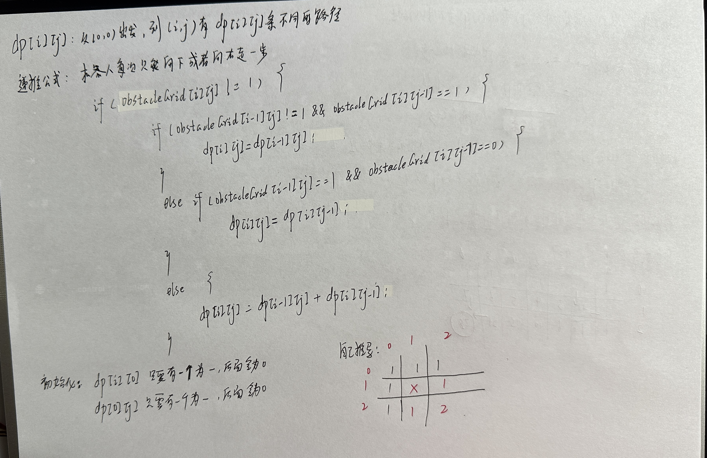
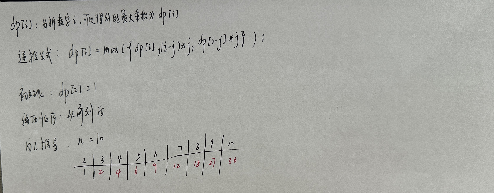

# 基础题目

## 509 斐波那契数

+ LeetCode509.cpp

## 70 爬楼梯

+ LeetCode70.cpp

## 746 使用最小花费爬楼梯

+ LeetCode746.cpp

## 62 不同路径

+ LeetCode62.cpp

 

## 63 不同路径II

+ LeetCode63.cpp

 

## 343 整数拆分

+ LeetCode343.cpp

 

