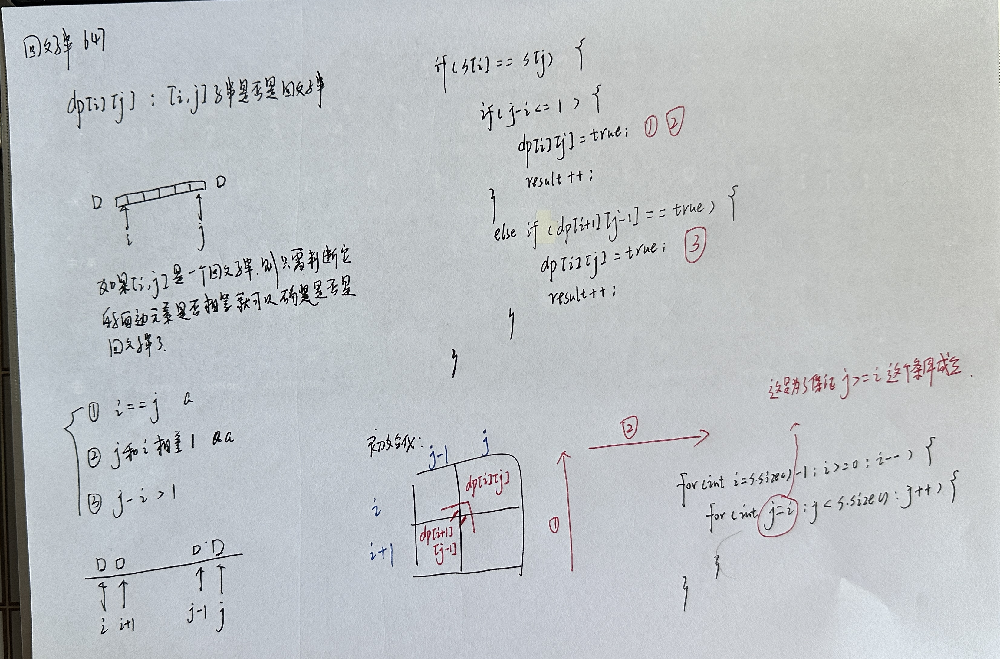
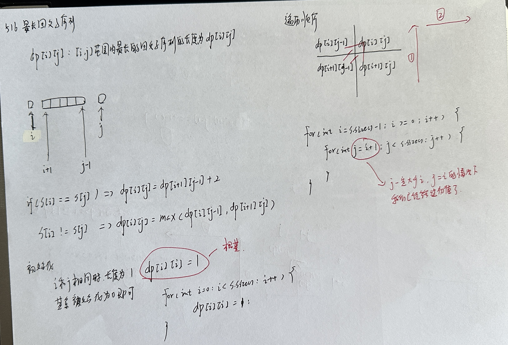
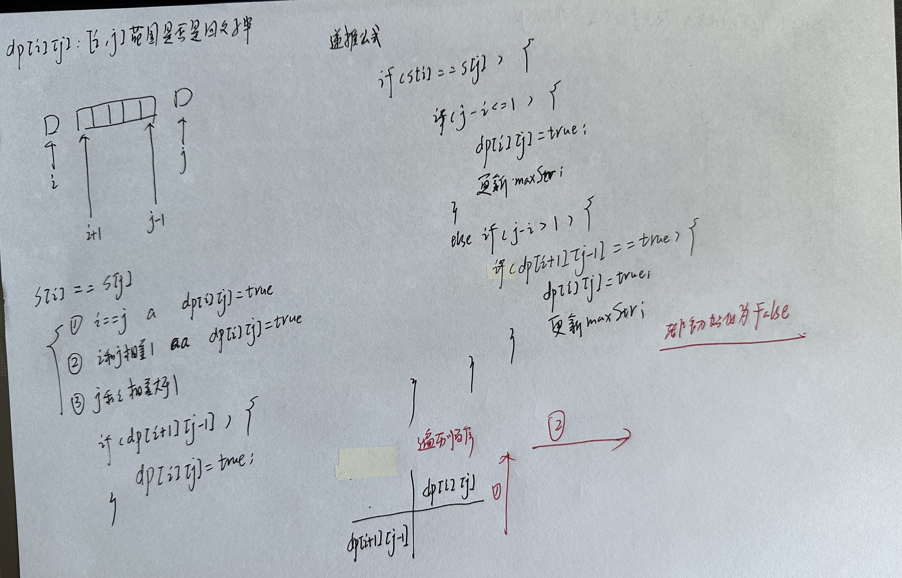

# 子序列问题

## 子序列不连续

### 300 最长上升子序列

### 1143 最长公共子序列

### 1035 不相交的线

## 子序列连续

### 674 最长连续递增序列

### 718 最长重复子数组

### 53 最长子序和

## 编辑距离

### 392 判断子序列

### 115 不同的子序列

### 583 两个字符串的删除操作

### 72 编辑距离

## 回文

### 647 回文子串

[LeetCode647.cpp](https://github.com/niu0217/Documents/blob/main/Algorithm/DynamicProgramming/LeetCode647.cpp)

 

### 516 最长回文子序列

[LeetCode516.cpp](https://github.com/niu0217/Documents/blob/main/Algorithm/DynamicProgramming/LeetCode516.cpp)

 

### 5 最长回文子串

[LeetCode5.cpp](https://github.com/niu0217/Documents/blob/main/Algorithm/DynamicProgramming/LeetCode5.cpp)

 