# 背包问题

## 背包类型

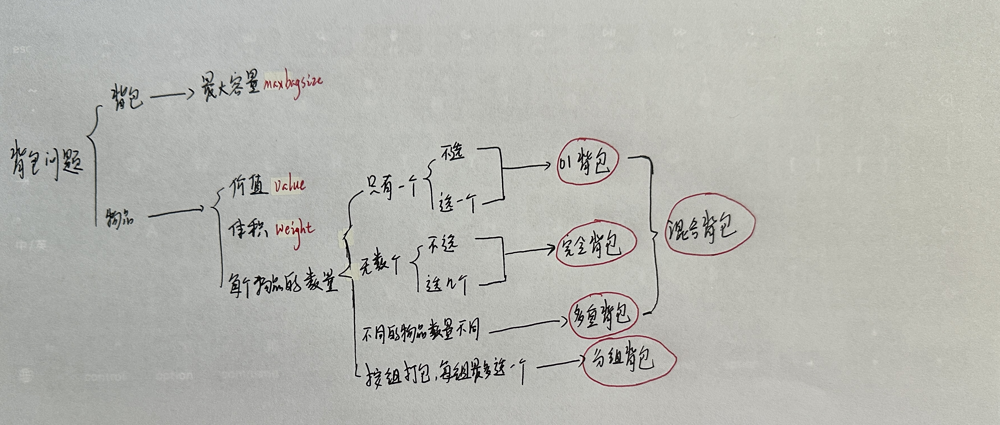 

## 01背包

### 理论

#### 二维数组实现

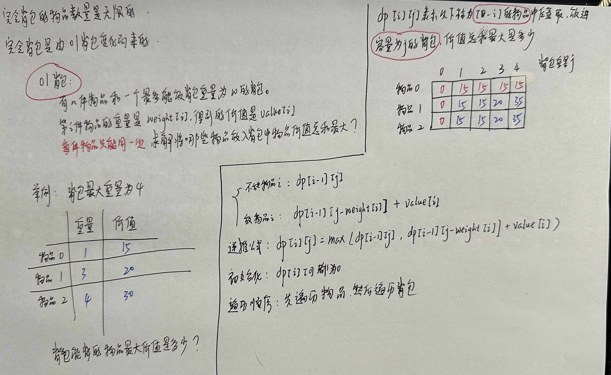 

```c++
#include <bits/stdc++.h>
using namespace std;

int n, bagweight;// bagweight代表行李箱空间
void solve() {
    vector<int> weight(n, 0); // 存储每件物品所占空间
    vector<int> value(n, 0);  // 存储每件物品价值
    for(int i = 0; i < n; ++i) {
        cin >> weight[i];
    }
    for(int j = 0; j < n; ++j) {
        cin >> value[j];
    }
    // dp数组, dp[i][j]代表行李箱空间为j的情况下,从下标为[0, i]的物品里面任意取,能达到的最大价值
    vector<vector<int>> dp(weight.size(), vector<int>(bagweight + 1, 0));

    // 初始化, 因为需要用到dp[i - 1]的值
    // j < weight[0]已在上方被初始化为0
    // j >= weight[0]的值就初始化为value[0]
    for (int j = weight[0]; j <= bagweight; j++) {
        dp[0][j] = value[0];
    }

    for(int i = 1; i < weight.size(); i++) { // 遍历科研物品
        for(int j = 1; j <= bagweight; j++) { // 遍历行李箱容量
            // 如果装不下这个物品,那么就继承dp[i - 1][j]的值
            if (j < weight[i]) dp[i][j] = dp[i - 1][j];
            // 如果能装下,就将值更新为 不装这个物品的最大值 和 装这个物品的最大值 中的 最大值
            // 装这个物品的最大值由容量为j - weight[i]的包任意放入序号为[0, i - 1]的最大值 + 该物品的价值构成
            else dp[i][j] = max(dp[i - 1][j], dp[i - 1][j - weight[i]] + value[i]);
        }
    }
    cout << dp[weight.size() - 1][bagweight] << endl;
}

int main() {
    while(cin >> n >> bagweight) {
        solve();
    }
    return 0;
}
```

#### 一维数组实现

  

```c++
void test_1_wei_bag_problem() {
    vector<int> weight = {1, 3, 4};
    vector<int> value = {15, 20, 30};
    int bagWeight = 4;

    // 初始化
    vector<int> dp(bagWeight + 1, 0);
    for(int i = 0; i < weight.size(); i++) { // 遍历物品
        for(int j = bagWeight; j >= weight[i]; j--) { // 遍历背包容量
            dp[j] = max(dp[j], dp[j - weight[i]] + value[i]);
        }
    }
    cout << dp[bagWeight] << endl;
}

int main() {
    test_1_wei_bag_problem();
}
```

### 416 分割等和子集

[LeetCode416.cpp](https://github.com/niu0217/Documents/blob/main/Algorithm/DynamicProgramming/LeetCode416.cpp)

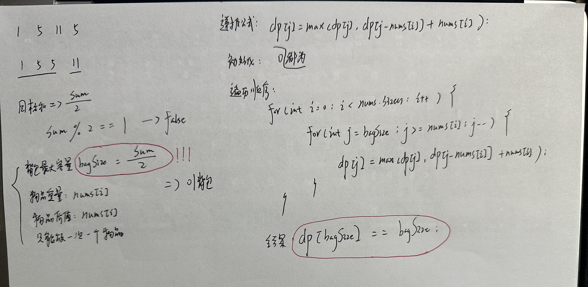  

### 1049 最后一块石头的重量II

[LeetCode1049.cpp](https://github.com/niu0217/Documents/blob/main/Algorithm/DynamicProgramming/LeetCode1049.cpp)

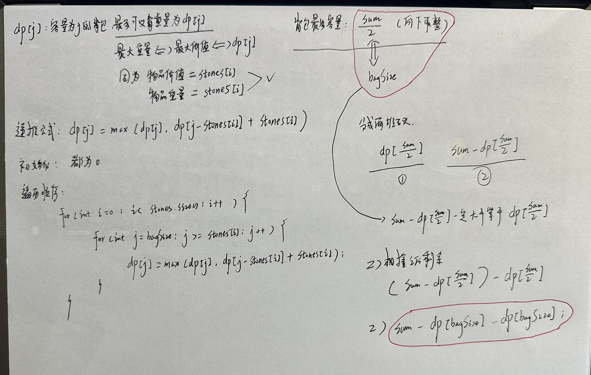 

### 494 目标和

[LeetCode494.cpp](https://github.com/niu0217/Documents/blob/main/Algorithm/DynamicProgramming/LeetCode494.cpp)

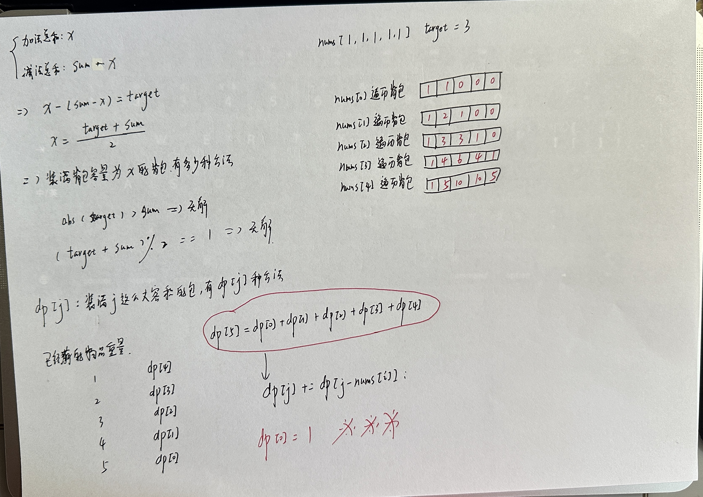 

### 474 一和零

[LeetCode474.cpp](https://github.com/niu0217/Documents/blob/main/Algorithm/DynamicProgramming/LeetCode474.cpp)

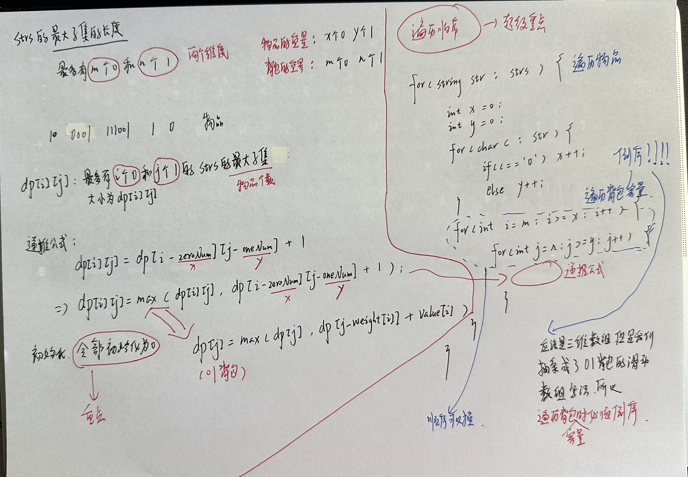 

## 完全背包

### 理论

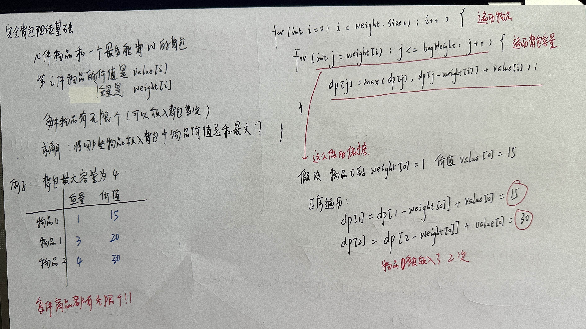 

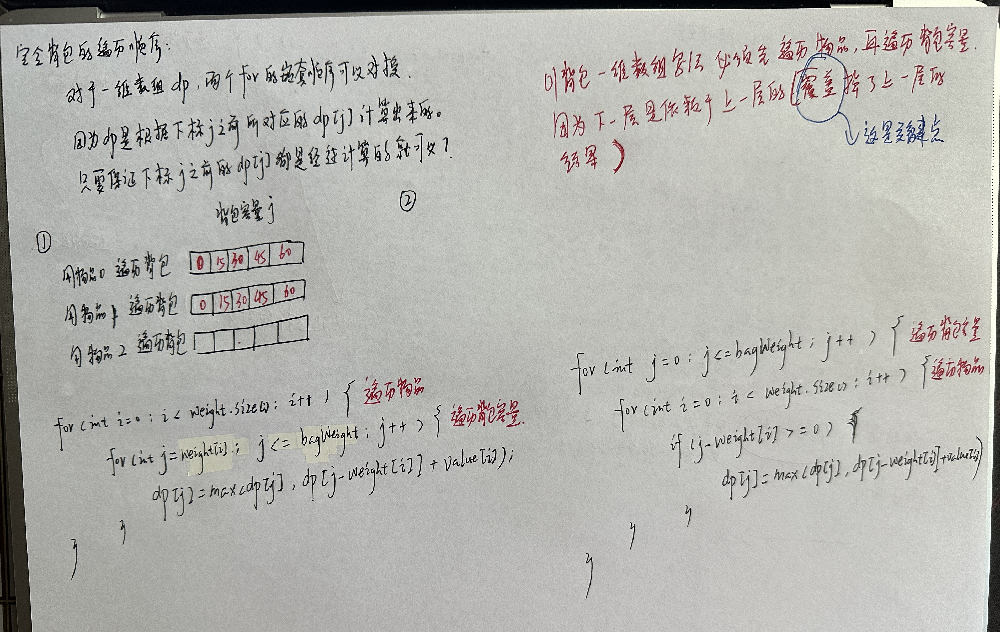 

### 518 零钱兑换II

[LeetCode518.cpp](https://github.com/niu0217/Documents/blob/main/Algorithm/DynamicProgramming/LeetCode518.cpp)

```
递推公式：
装满原容量为1的背包，有dp【4】种方法;
装满原容量为2的背包，有dp【3】种方法;
装满原容量为3的背包，有dp【2】种方法;
装满原容量为4的背包，有dp【1】种方法;
装满原容量为5的背包，有dp【0】种方法;
故，dp【5】 = dp【4】+...dp【0】,即dp【j】 += dp[j-nums【i】]
```

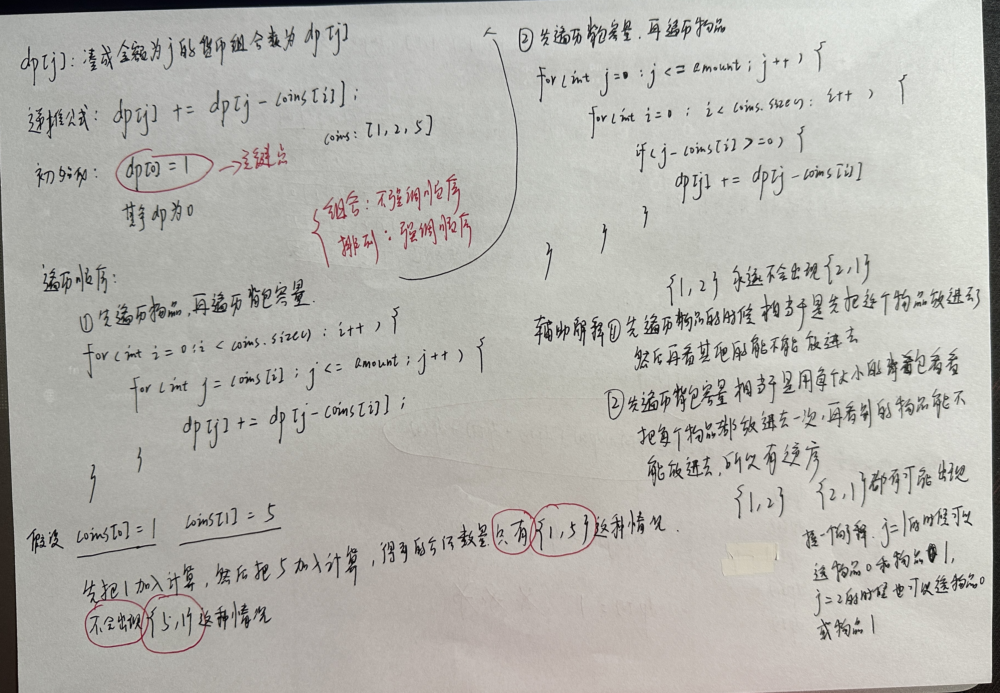 

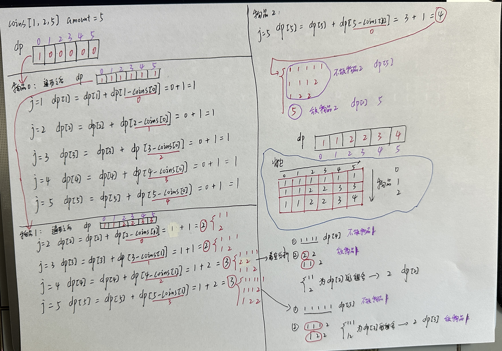  

### 377 组合总和IV

[LeetCode377.cpp](https://github.com/niu0217/Documents/blob/main/Algorithm/DynamicProgramming/LeetCode377.cpp)

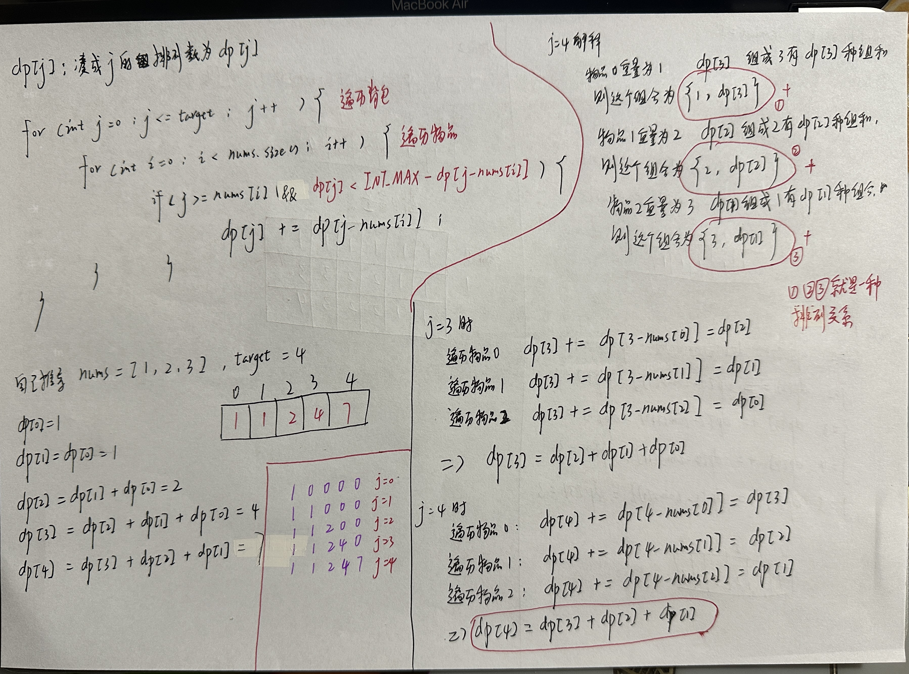  

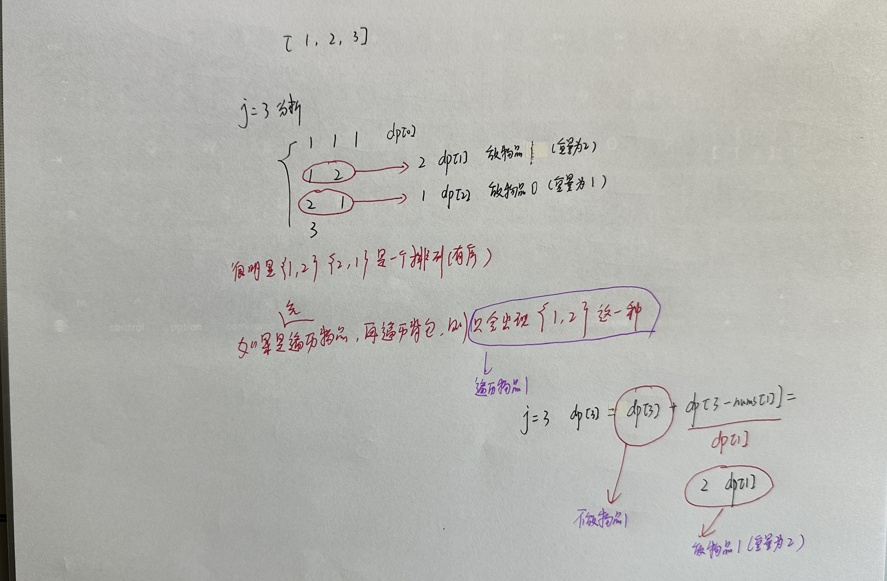 

### 70 爬楼梯

https://kamacoder.com/problempage.php?pid=1067

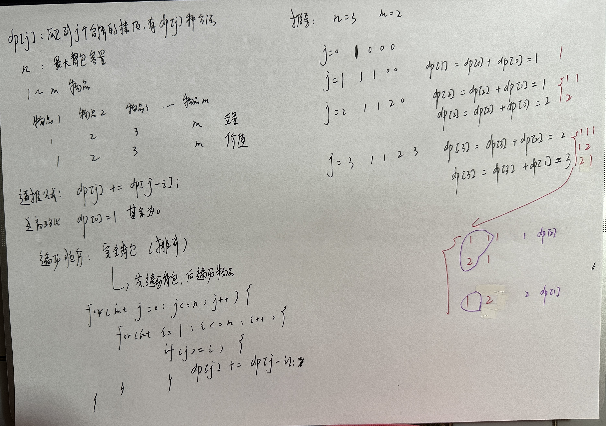  

```c++
#include<iostream>
#include<vector>

using namespace std;

int main()
{
    int n;
    int m;
    cin>>n>>m;
    vector<int> dp(n + 1, 0);
    dp[0] = 1;
    for(int j = 0; j <= n; j++) {
        for(int i = 1; i <= m; i++) {
            if(j >= i) {
                dp[j] += dp[j - i];
            }
        }
    }
    cout<<dp[n]<<endl;
}
```

### 322 零钱兑换

[LeetCode322.cpp](https://github.com/niu0217/Documents/blob/main/Algorithm/DynamicProgramming/LeetCode322.cpp)

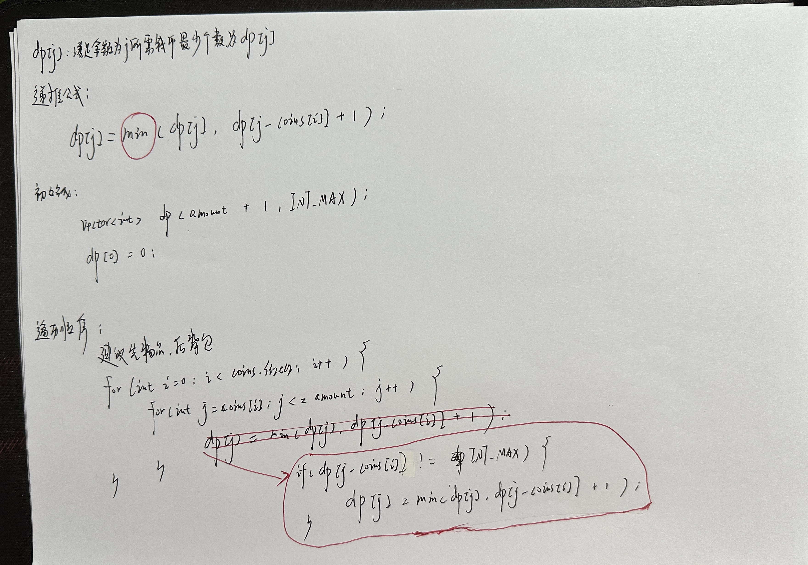 

```
0 1 2 3 4 5 6 7 8 9 10 11
0 1 1 2 2 3 3 4 4 5 5 6
0 1 1 2 2 1 2 2 3 3 2 3

coins = [1 2 5]
amount = 11
```

### 279 完全平方数

[LeetCode279.cpp](https://github.com/niu0217/Documents/blob/main/Algorithm/DynamicProgramming/LeetCode279.cpp)

 

### 179 单词拆分

[LeetCode139.cpp](https://github.com/niu0217/Documents/blob/main/Algorithm/DynamicProgramming/LeetCode139.cpp)

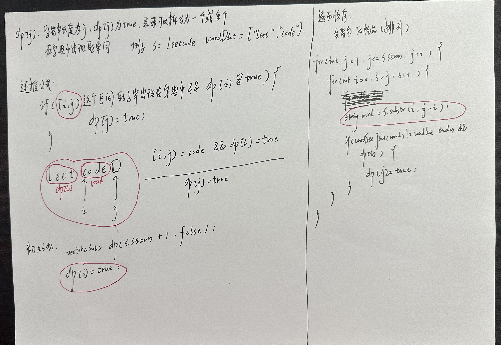 

## 多重背包

### 理论

|       | 重量 | 价值 | 数量 |
| ----- | ---- | ---- | ---- |
| 物品0 | 1    | 15   | 2    |
| 物品1 | 3    | 20   | 3    |
| 物品2 | 4    | 30   | 2    |

|       | 重量 | 价值 | 数量 |
| ----- | ---- | ---- | ---- |
| 物品0 | 1    | 15   | 1    |
| 物品0 | 1    | 15   | 1    |
| 物品1 | 3    | 20   | 1    |
| 物品1 | 3    | 20   | 1    |
| 物品1 | 3    | 20   | 1    |
| 物品2 | 4    | 30   | 1    |
| 物品2 | 4    | 30   | 1    |

```c++
#include<iostream>
#include<vector>
using namespace std;
int main() {
    int bagWeight,n;
    cin >> bagWeight >> n;
    vector<int> weight(n, 0);
    vector<int> value(n, 0);
    vector<int> nums(n, 0);
    for (int i = 0; i < n; i++) cin >> weight[i];
    for (int i = 0; i < n; i++) cin >> value[i];
    for (int i = 0; i < n; i++) cin >> nums[i];

    vector<int> dp(bagWeight + 1, 0);

    for(int i = 0; i < n; i++) { // 遍历物品
        for(int j = bagWeight; j >= weight[i]; j--) { // 遍历背包容量
            // 以上为01背包，然后加一个遍历个数
            for (int k = 1; k <= nums[i] && (j - k * weight[i]) >= 0; k++) { // 遍历个数
                dp[j] = max(dp[j], dp[j - k * weight[i]] + k * value[i]);
            }
        }
    }

    cout << dp[bagWeight] << endl;
}

```

### HJ41：称砝码

[题目链接](https://www.nowcoder.com/practice/f9a4c19050fc477e9e27eb75f3bfd49c?tpId=37&tags=&title=&difficulty=&judgeStatus=&rp=1&gioEnter=menu)

[思路](https://www.nowcoder.com/practice/f9a4c19050fc477e9e27eb75f3bfd49c?tpId=37&tags=&title=&difficulty=&judgeStatus=&rp=1&gioEnter=menu)

代码：

```c++
#include<iostream>
#include<vector>
#include<unordered_set>
#include<algorithm>

using namespace std;

int main()
{
    int n;
    while(cin>>n) {
        int sum = 0;
        vector<int> weight(n); //砝码的重量
        vector<int> num(n); //砝码的数量
        for(int i = 0; i < n; i++) {
            cin>>weight[i];
        }
        for(int i = 0; i < n; i++) {
            cin>>num[i];
            sum += num[i] * weight[i];
        }
        //dp[i]: 重量i是否出现
        vector<bool> dp(sum + 1, false); //背包的一维数组表示
        dp[0] = true;
        for(int i = 0; i < n; i++) { //遍历物品
            for(int j = 0; j < num[i]; j++) { //遍历物品数量
                for(int k = sum; k >= weight[i]; k--) { //遍历背包容量
                    if(dp[k - weight[i]]) {
                        dp[k] = true;
                    }
                }
            }
        }
        int count = 0;
        for(int i = 0; i <= sum; i++) {
            if(dp[i]) {
                count++;
            }
        }
        cout<<count<<endl;
    }
}
```

 

