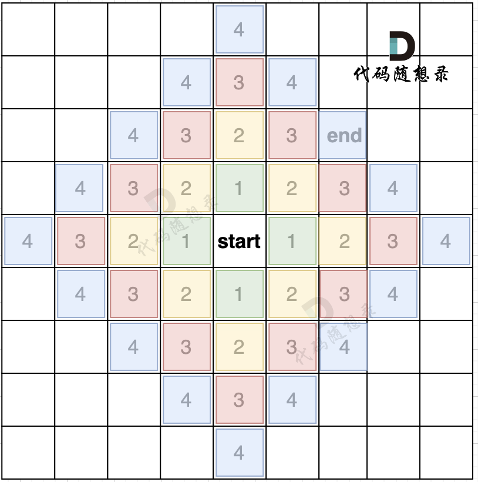

# 图

## 基础

### 广度优先搜索的模版

```c++
int dir[4][2] = {0, 1, 1, 0, -1, 0, 0, -1}; // 表示四个方向
// grid 是地图，也就是一个二维数组
// visited标记访问过的节点，不要重复访问
// x,y 表示开始搜索节点的下标
void bfs(vector<vector<char>>& grid, vector<vector<bool>>& visited, int x, int y) {
    queue<pair<int, int>> que; // 定义队列
    que.push({x, y}); // 起始节点加入队列
    visited[x][y] = true; // 只要加入队列，立刻标记为访问过的节点
    while(!que.empty()) { // 开始遍历队列里的元素
        pair<int ,int> cur = que.front(); que.pop(); // 从队列取元素
        int curx = cur.first;
        int cury = cur.second; // 当前节点坐标
        for (int i = 0; i < 4; i++) { // 开始向当前节点的四个方向左右上下去遍历
            int nextx = curx + dir[i][0];
            int nexty = cury + dir[i][1]; // 获取周边四个方向的坐标
            if (nextx < 0 || nextx >= grid.size() || nexty < 0 || nexty >= grid[0].size()) continue;  // 坐标越界了，直接跳过
            if (!visited[nextx][nexty]) { // 如果节点没被访问过
                que.push({nextx, nexty});  // 队列添加该节点为下一轮要遍历的节点
                visited[nextx][nexty] = true; // 只要加入队列立刻标记，避免重复访问
            }
        }
    }

}
```

 

 

## 实战

### 所有可能的路径

[LeetCode797.cpp](https://github.com/niu0217/Documents/blob/main/Algorithm/Graph/LeetCode797.cpp)

### 岛屿数量

[LeetCode200.cpp](https://github.com/niu0217/Documents/blob/main/Algorithm/Graph/LeetCode200.cpp)

 

本题思路：遇到一个没有遍历过的节点陆地，计数器就加一，然后把该节点陆地所能遍历到的陆地都标记上。在遇到标记过的陆地节点和海洋节点的时候就直接跳过。

### 岛屿的最大面积

### 飞地的数量

### 被围绕的区域

### 太平洋大西洋水流问题

### 最大人工岛

### 单词接龙

### 钥匙和房间

### 岛屿的周长

### 寻找图中是否存在路径

### 冗余连接

### 冗余连接II


