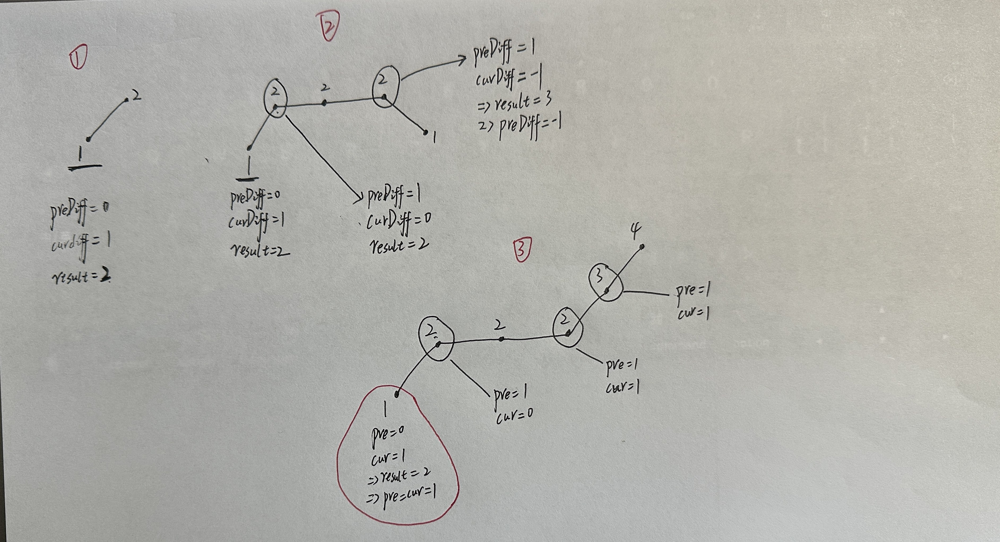
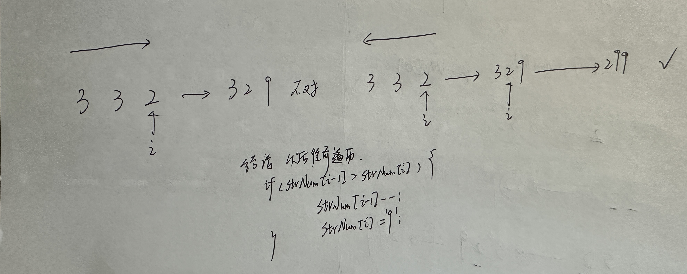
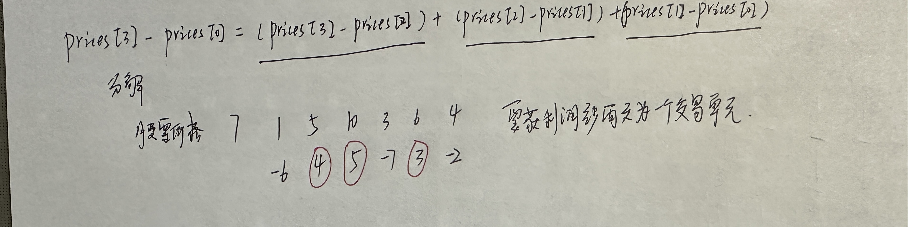

# 贪心

## 引入

本质：选择每一个阶段的局部最优，从而达到全局最优。

## 1. 简单题目

（1）分发饼干

[LeetCode455.cpp](https://github.com/niu0217/Documents/blob/main/Algorithm/Greedy/LeetCode455.cpp)

（2）K次取反后最大化的数组和

[LeetCode1005.cpp](https://github.com/niu0217/Documents/blob/main/Algorithm/Greedy/LeetCode1005.cpp)

（3）柠檬水找零

[LeetCode860.cpp](https://github.com/niu0217/Documents/blob/main/Algorithm/Greedy/LeetCode860.cpp)

## 2. 中等题目

### 2.1 序列问题

（1）摆动序列

[LeetCode376.cpp](https://github.com/niu0217/Documents/blob/main/Algorithm/Greedy/LeetCode376.cpp)

 

（2）单调递增的数字

[LeetCode738.cpp](https://github.com/niu0217/Documents/blob/main/Algorithm/Greedy/LeetCode738.cpp)

 

### 2.2 贪心解决股票问题

（1）买卖股票的最佳时机II

[LeetCode122.cpp](https://github.com/niu0217/Documents/blob/main/Algorithm/Greedy/LeetCode122.cpp)

 

（2）买卖股票的最佳时机含手续费

留着

### 2.3 两个维度权衡问题

（1）分发糖果

[LeetCode135.cpp](https://github.com/niu0217/Documents/blob/main/Algorithm/Greedy/LeetCode135.cpp)

（2）根据身高重建队列

[LeetCode406.cpp](https://github.com/niu0217/Documents/blob/main/Algorithm/Greedy/LeetCode406.cpp)

## 困难

### 区间问题

（1）跳跃游戏

[LeetCode55.cpp](https://github.com/niu0217/Documents/blob/main/Algorithm/Greedy/LeetCode55.cpp)

（2）跳跃游戏II

[LeetCode45.cpp](https://github.com/niu0217/Documents/blob/main/Algorithm/Greedy/LeetCode45.cpp)

（3）用最少数量的箭引爆气球

[LeetCode452.cpp](https://github.com/niu0217/Documents/blob/main/Algorithm/Greedy/LeetCode452.cpp)

（4）无重叠区间

[LeetCode435.cpp](https://github.com/niu0217/Documents/blob/main/Algorithm/Greedy/LeetCode435.cpp)

（5）划分字母区间

[LeetCode763.cpp](https://github.com/niu0217/Documents/blob/main/Algorithm/Greedy/LeetCode763.cpp)

（6）合并区间

[LeetCode56.cpp](https://github.com/niu0217/Documents/blob/main/Algorithm/Greedy/LeetCode56.cpp)

### 其余

（1）最大子序和

[LeetCode53.cpp](https://github.com/niu0217/Documents/blob/main/Algorithm/Greedy/LeetCode53.cpp)

（2）加油站

[LeetCode134.cpp](https://github.com/niu0217/Documents/blob/main/Algorithm/Greedy/LeetCode134.cpp)

（3）监控二叉树

[LeetCode968.cpp](https://github.com/niu0217/Documents/blob/main/Algorithm/Greedy/LeetCode968.cpp)