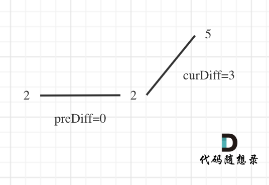

# 贪心Days1

## [455. 分发饼干](https://leetcode.cn/problems/assign-cookies/)

思路：局部最优就是大饼干喂给胃口大的，充分利用饼干尺寸喂饱一个，全局最优就是喂饱尽可能多的小孩。

```c++
class Solution {
public:
    int findContentChildren(vector<int>& g, vector<int>& s) {
        sort(g.begin(), g.end());
        sort(s.begin(), s.end());
        int result = 0;
        int j = s.size() - 1;  // 饼干的下标
        int i;  // 小孩胃口的下标
        for (i = g.size() - 1; i >= 0; i--) {
            if (j >= 0 && s[j] >= g[i]) {
                result++;
                j--;
            }
        }
        return result;
    }
};
```

## [376. 摆动序列](https://leetcode.cn/problems/wiggle-subsequence/)

一般情况：

在计算是否有峰值的时候，大家知道遍历的下标 i ，计算 prediff（nums[i] - nums[i-1]） 和 curdiff（nums[i+1] - nums[i]），如果`prediff < 0 && curdiff > 0` 或者 `prediff > 0 && curdiff < 0` 此时就有波动就需要统计。


三种特殊情况：

1. 情况一：上下坡中有平坡
2. 情况二：数组首尾两端
3. 情况三：单调坡中有平坡

情况一：

 

 

如果我们采用，删左面三个 2 的规则，那么 当 `prediff = 0 && curdiff < 0` 也要记录一个峰值，因为他是把之前相同的元素都删掉留下的峰值。

所以我们记录峰值的条件应该是： `(preDiff <= 0 && curDiff > 0) || (preDiff >= 0 && curDiff < 0)`

情况二：

 

为了规则统一，针对序列[2,5]，可以假设为[2,2,5]，这样它就有坡度了即 preDiff = 0。

针对以上情形，result 初始为 1（默认最右面有一个峰值），此时 curDiff > 0 && preDiff <= 0，那么 result++（计算了左面的峰值），最后得到的 result 就是 2（峰值个数为 2 即摆动序列长度为 2）。

情况三：

 

图中，我们可以看出，版本一的代码在三个地方记录峰值，但其实结果因为是 2，因为 单调中的平坡 不能算峰值（即摆动）。

之所以版本一会出问题，是因为我们实时更新了 prediff。

那么我们应该什么时候更新 prediff 呢？

我们只需要在 这个坡度 摆动变化的时候，更新 prediff 就行，这样 prediff 在 单调区间有平坡的时候 就不会发生变化，造成我们的误判。

代码：

```c++
class Solution {
public:
    int wiggleMaxLength(vector<int>& nums) {
        int curDiff = 0;
        int preDiff = 0;
        int result = 1;
        for (int i = 0; i < nums.size() - 1; i++) {
            curDiff = nums[i + 1] - nums[i];
            if ((preDiff >= 0 && curDiff < 0) || (preDiff <= 0 && curDiff > 0)) {
                result++;
                preDiff = curDiff;
            }
        }
        return result;
    }
};
```

## [53. 最大子数组和](https://leetcode.cn/problems/maximum-subarray/)

**暴力（超时）**

```c++
class Solution {
public:
    int maxSubArray(vector<int>& nums) {
        int result = INT_MIN;
        for (int i = 0; i < nums.size(); i++) {
            int count = 0;
            for (int j = i; j < nums.size(); j++) {
                count += nums[j];
                result = result > count ? result : count;
            }
        }
        return result;
    }
};
```

**贪心**

如果 -2 1 在一起，计算起点的时候，一定是从 1 开始计算，因为负数只会拉低总和，这就是贪心贪的地方！

局部最优：当前“连续和”为负数的时候立刻放弃，从下一个元素重新计算“连续和”，因为负数加上下一个元素 “连续和”只会越来越小。

全局最优：选取最大“连续和”

```c++
class Solution {
public:
    int maxSubArray(vector<int>& nums) {
        int result = INT_MIN;
        int count = 0;
        for (int i = 0; i < nums.size(); i++) {
            count += nums[i];
            if (count > result) {
                result = count;
            }
            if (count < 0) {
                count = 0;
            }
        }
        return result;
    }
};
```

