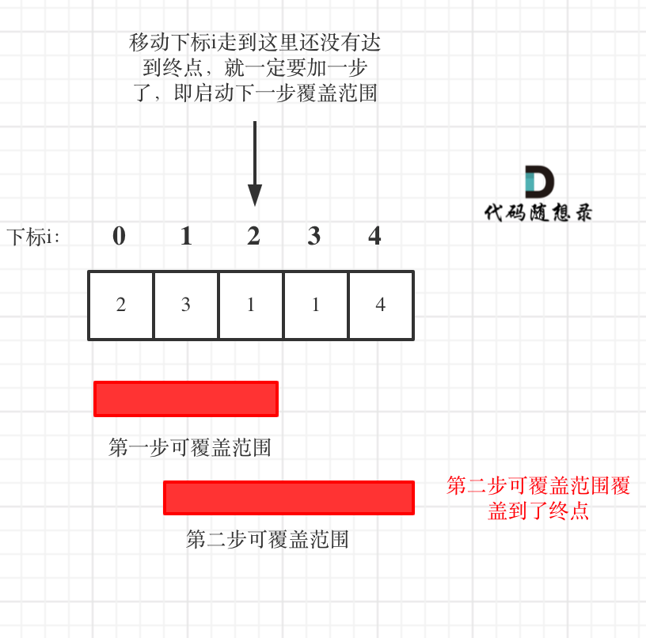

# 贪心Days2

## [122. 买卖股票的最佳时机 II](https://leetcode.cn/problems/best-time-to-buy-and-sell-stock-ii/)

```c++
class Solution {
public:
    int maxProfit(vector<int>& prices) {
        int result = 0;
        for (int i = 1; i < prices.size(); i++) {
            result += max(prices[i] - prices[i - 1], 0);
        }
        return result;
    }
};
```

## [55. 跳跃游戏](https://leetcode.cn/problems/jump-game/)

贪心：跳跃覆盖范围究竟可不可以覆盖到终点

贪心算法局部最优解：每次取最大跳跃步数（取最大覆盖范围）。

整体最优解：最后得到整体最大覆盖范围，看是否能到终点。

```c++
class Solution {
public:
    bool canJump(vector<int>& nums) {
        int cover = 0;
        for (int i = 0; i <= cover; i++) {
            cover = max(i + nums[i], cover);
            if (cover >= nums.size() - 1) {
                return true;
            }
        }
        return false;
    }
};
```

## [45. 跳跃游戏 II](https://leetcode.cn/problems/jump-game-ii/)

要从覆盖范围出发，不管怎么跳，覆盖范围内一定是可以跳到的，以最小的步数增加覆盖范围，覆盖范围一旦覆盖了终点，得到的就是最少步数！

统计两个覆盖范围，当前这一步的最大覆盖和下一步最大覆盖。

 

移动下标达到了当前覆盖的最远距离下标时，步数就要加一，来增加覆盖距离。最后的步数就是最少步数。

```c++
class Solution {
public:
    int jump(vector<int>& nums) {
        if (nums.size() == 1) {
            return 0;
        }
        int curDistance = 0;
        int nextDistance = 0;
        int times = 0;
        for (int i = 0; i < nums.size(); i++) {
            nextDistance = max(nextDistance, i + nums[i]);
            if (i == curDistance) {
                times++;
                curDistance = nextDistance;
                if (nextDistance >= nums.size() - 1) {
                    break;
                }
            }
        }
        return times;
    }
};
```

## [1005. K 次取反后最大化的数组和](https://leetcode.cn/problems/maximize-sum-of-array-after-k-negations/)

贪心的思路，局部最优：让绝对值大的负数变为正数，当前数值达到最大，整体最优：整个数组和达到最大。

局部最优可以推出全局最优。

那么如果将负数都转变为正数了，K依然大于0，此时的问题是一个有序正整数序列，如何转变K次正负，让 数组和 达到最大。

那么又是一个贪心：局部最优：只找数值最小的正整数进行反转，当前数值和可以达到最大（例如正整数数组{5, 3, 1}，反转1 得到-1 比 反转5得到的-5 大多了），全局最优：整个 数组和 达到最大。

那么本题的解题步骤为：

- 第一步：将数组按照绝对值大小从大到小排序，**注意要按照绝对值的大小**
- 第二步：从前向后遍历，遇到负数将其变为正数，同时K--
- 第三步：如果K还大于0，那么反复转变数值最小的元素，将K用完
- 第四步：求和

```c++
class Solution {
public:
    static bool compare(int a, int b) {
        return abs(a) > abs(b);
    }
public:
    int largestSumAfterKNegations(vector<int>& nums, int k) {
        sort(nums.begin(), nums.end(), compare);
        for (int i = 0; i < nums.size(); i++) {
            if (nums[i] < 0 && k > 0) {
                nums[i] *= -1;
                k--;
            }
        }
        if (k % 2 == 1) {
            nums[nums.size() - 1] *= -1;
        }
        int result = accumulate(nums.begin(), nums.end(), 0);
        return result;
    }
};
```

