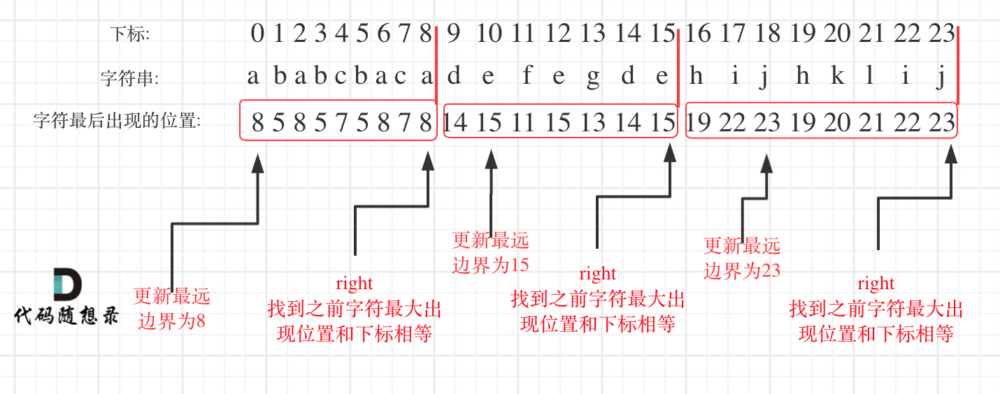

# 贪心Days4

## [452. 用最少数量的箭引爆气球](https://leetcode.cn/problems/minimum-number-of-arrows-to-burst-balloons/)

```c++
class Solution {
public:
    static bool compare(vector<int> &a, vector<int> &b) {
        return a[0] < b[0];
    }
public:
    int findMinArrowShots(vector<vector<int>>& points) {
        sort(points.begin(), points.end(), compare);
        int result = 1;
        for (int i = 1; i < points.size(); i++) {
            if (points[i][0] > points[i - 1][1]) {
                result++;
            }
            else {
                points[i][1] = min(points[i][1], points[i - 1][1]);
            }
        }
        return result;
    }
};
```

## [435. 无重叠区间](https://leetcode.cn/problems/non-overlapping-intervals/)

```c++
class Solution {
public:
    static bool compare(vector<int> &a, vector<int> &b) {
        return a[0] < b[0];
    }
public:
    int eraseOverlapIntervals(vector<vector<int>>& points) {
        sort(points.begin(), points.end(), compare);
        int result = 1;
        for (int i = 1; i < points.size(); i++) {
            if (points[i][0] >= points[i - 1][1]) {
                result++;
            }
            else {
                points[i][1] = min(points[i][1], points[i - 1][1]);
            }
        }
        return points.size() - result;
    }
};
```

## [763. 划分字母区间](https://leetcode.cn/problems/partition-labels/)

在遍历的过程中相当于是要找每一个字母的边界，**如果找到之前遍历过的所有字母的最远边界，说明这个边界就是分割点了**。此时前面出现过所有字母，最远也就到这个边界了。

 

```c++
class Solution {
public:
    vector<int> partitionLabels(string s) {
        int hash[27] = {0};
        for (int i = 0; i < s.size(); i++) {
            hash[s[i] - 'a'] = i;
        }
        int left = 0;
        int right = 0;
        vector<int> result;
        for (int i = 0; i < s.size(); i++) {
            right = max(right, hash[s[i] - 'a']);
            if (i == right) {
                result.push_back(right - left + 1);
                left = i + 1;
            }
        }
        return result;
    }
};
```

