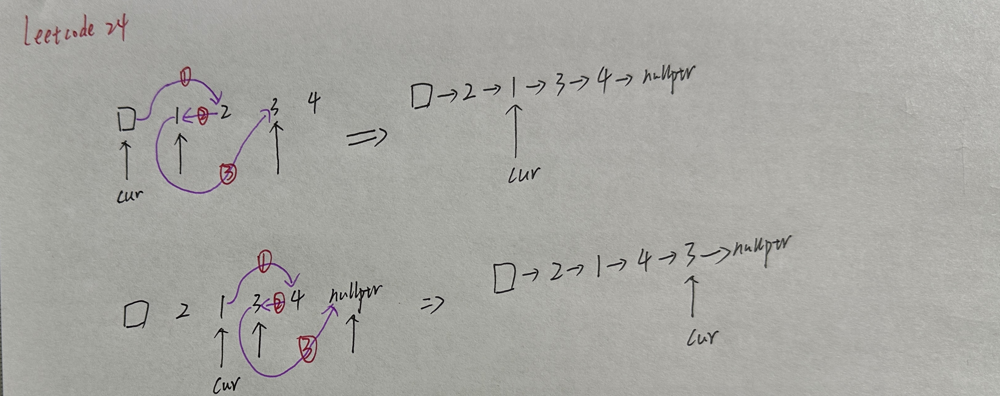
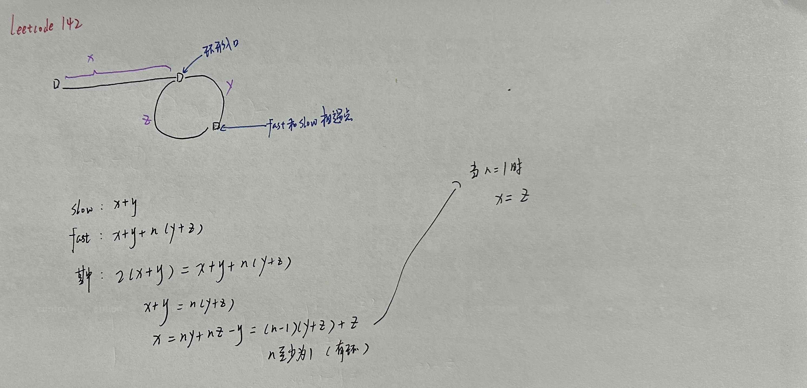

# 链表

## 移除链表元素

+ LeetCode203.cpp

## 设计链表

+ LeetCode707.cpp

## 翻转链表

+ LeetCode206.cpp

## 两两交换链表中的节点

 

+ LeetCode24.cpp

## 删除链表的倒数第N个节点

+ LeetCode19.cpp

## 链表相交

+ LeetCode160.cpp

## 环形链表II

 

+ LeetCode142.cpp
