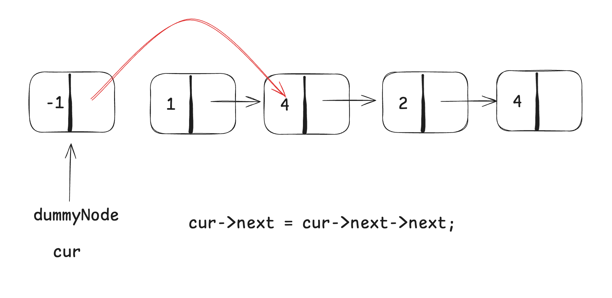
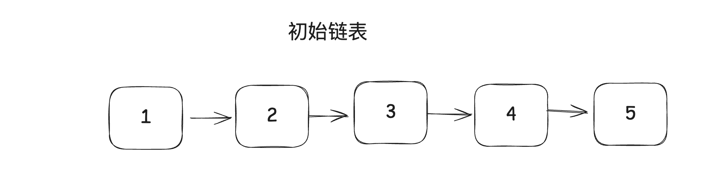
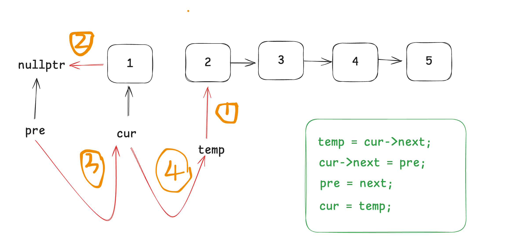
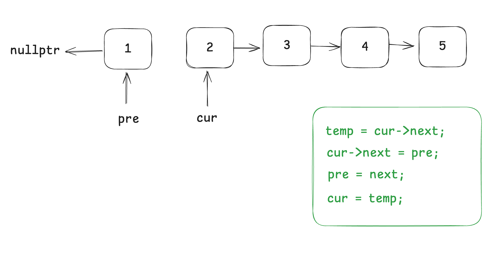

# 链表题目Days1

## [203. 移除链表元素](https://leetcode.cn/problems/remove-linked-list-elements/)

 

```c++
/**
 * Definition for singly-linked list.
 * struct ListNode {
 *     int val;
 *     ListNode *next;
 *     ListNode() : val(0), next(nullptr) {}
 *     ListNode(int x) : val(x), next(nullptr) {}
 *     ListNode(int x, ListNode *next) : val(x), next(next) {}
 * };
 */
class Solution {
public:
    ListNode* removeElements(ListNode* head, int val) {
        ListNode *dummyNode = new ListNode(-1);
        dummyNode->next = head;
        ListNode *cur = dummyNode;
        while (cur->next) {
            if (cur->next->val == val) {
                ListNode *temp = cur->next;
                cur->next = cur->next->next;
                delete temp;
            }
            else {
                cur = cur->next;
            }
        }
        head = dummyNode->next;
        delete dummyNode;
        return head;
    }
};
```

## [707. 设计链表](https://leetcode.cn/problems/design-linked-list/)

```c++
class MyLinkedList {
public:
    struct LinkedNode {
        int val;
        LinkedNode *next;
        LinkedNode(int x, LinkedNode *node=nullptr)
            : val(x), next(node) {}
    };
public:
    MyLinkedList() {
        m_dummyHead = new LinkedNode(-1);
        m_size = 0;
    }
    
    int get(int index) {
        if (index < 0 || index >= m_size) {
            return -1;
        }
        LinkedNode *cur = m_dummyHead->next;
        while (index) {
            cur = cur->next;
            index--;
        }
        return cur->val;
    }
    
    void addAtHead(int val) {
        LinkedNode *node = new LinkedNode(val);
        node->next = m_dummyHead->next;
        m_dummyHead->next = node;
        m_size++;
    }
    
    void addAtTail(int val) {
        LinkedNode *cur = m_dummyHead;
        while (cur->next) {
            cur = cur->next;
        }
        LinkedNode *node = new LinkedNode(val);
        cur->next = node;
        m_size++;
    }
    
    void addAtIndex(int index, int val) {
        if (index < 0 || index > m_size) {
            return;
        }
        LinkedNode *cur = m_dummyHead;
        while (index) {
            cur = cur->next;
            index--;
        }
        LinkedNode *node = new LinkedNode(val);
        node->next = cur->next;
        cur->next = node;
        m_size++;
    }
    
    void deleteAtIndex(int index) {
        if (index < 0 || index >= m_size) {
            return;
        }
        LinkedNode *cur = m_dummyHead;
        while (index) {
            cur = cur->next;
            index--;
        }
        LinkedNode *temp = cur->next;
        cur->next = cur->next->next;
        delete temp;
        m_size--;
    }
private:
    int m_size;
    LinkedNode *m_dummyHead;
};

/**
 * Your MyLinkedList object will be instantiated and called as such:
 * MyLinkedList* obj = new MyLinkedList();
 * int param_1 = obj->get(index);
 * obj->addAtHead(val);
 * obj->addAtTail(val);
 * obj->addAtIndex(index,val);
 * obj->deleteAtIndex(index);
 */
```

## [206. 反转链表](https://leetcode.cn/problems/reverse-linked-list/)

 

 

 

```c++
/**
 * Definition for singly-linked list.
 * struct ListNode {
 *     int val;
 *     ListNode *next;
 *     ListNode() : val(0), next(nullptr) {}
 *     ListNode(int x) : val(x), next(nullptr) {}
 *     ListNode(int x, ListNode *next) : val(x), next(next) {}
 * };
 */
class Solution {
public:
    ListNode* reverseList(ListNode* head) {
        ListNode *pre = nullptr;
        ListNode *cur = head;
        while (cur) {
            ListNode *temp = cur->next;
            cur->next = pre;
            pre = cur;
            cur = temp;
        }
        return pre;
    }
};
```

