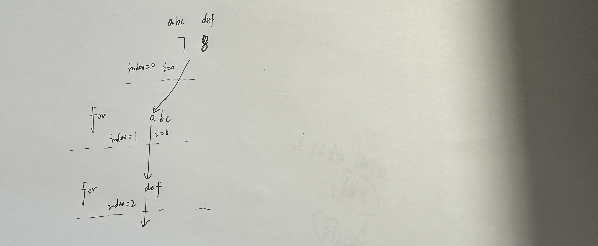

# 过滤组合字符串

## 题目描述

数字0、1、2、3、4、5、6、7、8、9分别关联 a~z 26个英文字母。

``` 
0关联"a"，"b"，"c"
1关联"d"，"e"，"f"
2关联"g"，"h"，"i"
3关联”J“，”k”，“T”
4关联"m"，"n"，"o"
5关联"p"，"q"，"r"
6关联"s"，"t"
7关联"u"，"V"
8关联"w"，"x"
9关联"y"，"z"
```

例如7关联"u"，"V"，8关联"×"，"w"，输入一个字符串例如"78"，
和一个屏蔽字符串“Ux'，那么'78'可以组成多个字符串例如：“ux'，“uw'，“ww\”，过滤这些完全包含屏蔽字符串的每一个字符的字符串，然后输出剩下的字符串。
示例：输入：78 UX 输出：UW VX VW
说明：ux完全包含屏蔽字符串ux，因此剔除

## 解题思路

1：一个map来保存所有的数字及其关联的英文字母。
2：先遍历求出所有的组合，然后利用string的find函数Q即可判定是否完全包含。

## 代码

```c++
#include<iostream>
#include<string>
#include<vector>

using namespace std;

const string digitMap[10] = {
    "abc", //0
    "def", //1
    "ghi", //2
    "JkT", //3
    "mno", //4
    "pqr", //5
    "st",  //6
    "uV",  //7
    "wx",  //8
    "yz"   //9
};

vector<string> result;
string path;
void backtracking(string& digitStr, const string& badStr, int index) {
    if(index == digitStr.size()) {
        if(path == badStr) {
            return;
        }
        result.push_back(path);
        return;
    }
    int digit = digitStr[index] - '0';
    string curStr = digitMap[digit];
    for(int i = 0; i < curStr.size(); i++) {
        path.push_back(curStr[i]);
        backtracking(digitStr, badStr, index + 1);
        path.pop_back();
    }
}

int main()
{
    string digitStr;
    string badStr;
    cin>>digitStr>>badStr;
    result.clear();
    path.clear();
    backtracking(digitStr, badStr, 0);
    for(string s : result) {
        cout<<s<<endl;
    }
    cout<<endl;
}
```

 

