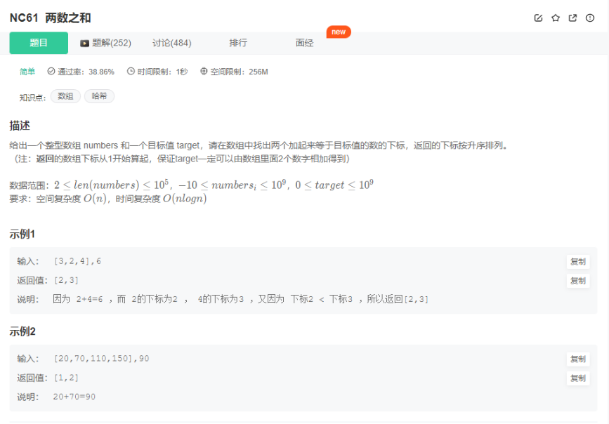

# 基础题目

## 1. 入门级别

### 1.1 输入处理 HJ5.进制转换

[题目链接](https://www.nowcoder.com/practice/8f3df50d2b9043208c5eed283d1d4da6?tpId=37&tqId=21228&rp=1&ru=/ta/huawei&qru=/ta/huawei/question-ranking&tab=answerKey)

题目描述：

```
写出一个程序，接受一个十六进制的数，输出该数值的十进制表示。

数据范围：保证结果在1 <= n <= 2^31 - 1

输入描述：
输入一个十六进制的数值字符串。

输出描述：
输出该数值的十进制字符串。不同组的测试用例用\n隔开。
```

示例1：

```
输入:0xAA
输出:170
```

代码：

```c++
/* ************************************************************************
> File Name:     1_1.cpp
> Author:        niu0217
> Created Time:  Thu 14 Mar 2024 03:26:12 PM CST
> Description:   HJ5 进制转换
 ************************************************************************/

#include <iostream>
using namespace std;

int main()
{
    string s;
    while(cin>>s) {
        int result = 0;
        int factor = 1;
        for(int i = s.size() - 1; i > 1; i--) {
            if(s[i] >= '0' && s[i] <= '9') {
                result += factor * (s[i] - '0');
            }
            else {
                result += factor * (s[i] - 'A' + 10);
            }
            factor *= 16;
        }
        cout<<result<<endl;
    }
}
```

### 1.2 排列组合（牛客搜索）NC61.两数之和

 

代码：

```c++
/* ************************************************************************
> File Name:     1_2.cpp
> Author:        niu0217
> Created Time:  Thu 14 Mar 2024 03:47:33 PM CST
> Description:   两数之和
 ************************************************************************/

#include<iostream>
#include<vector>
#include<unordered_map>

using namespace std;

vector<int> twoSum(vector<int>& nums, int target) {
    //key:   元素
    //value: 该元素的下标
    unordered_map<int, int> umap;
    for(int i = 0; i < nums.size(); i++) {
        auto iter = umap.find(target - nums[i]);
        if(iter != umap.end()) {
            return {iter->second, i + 1};
        }
        umap[nums[i]] = i + 1;
    }
}

int main()
{
    vector<int> nums = {
        3, 2, 4
    };
    int target = 6;
    vector<int> result = twoSum(nums, target);
    for(int num : result) {
        cout<<num<<" ";
    }
    cout<<endl;
}
```

### 1.3 递归：NC68.跳台阶

[题目链接](https://www.nowcoder.com/practice/8c82a5b80378478f9484d87d1c5f12a4?tpId=13&tqId=11161&ru=/exam/oj)

代码：

```c++
class Solution {
public:
    /**
     * 代码中的类名、方法名、参数名已经指定，请勿修改，直接返回方法规定的值即可
     *
     * 
     * @param number int整型 
     * @return int整型
     */
    int jumpFloor(int n) {
        if(n == 1) {
            return 1;
        }
        vector<int> dp(n + 1, 0);
        dp[0] = 1;
        dp[1] = 1;
        for(int i = 2; i <= n; i++) {
            dp[i] = dp[i - 1] + dp[i - 2];
        }
        return dp[n];
    }
};
```

### 1.4 快速排序 HJ3.明明的随机数

[题目链接](https://www.nowcoder.com/practice/3245215fffb84b7b81285493eae92ff0?tpId=37&tqId=21226&rp=1&ru=/exam/oj/ta&qru=/exam/oj/ta&sourceUrl=%2Fexam%2Foj%2Fta%3FtpId%3D37&difficulty=undefined&judgeStatus=undefined&tags=&title=)

代码：

```c++
#include <iostream>
#include<set>
using namespace std;

int main() {
    int n;
    int num;
    set<int> result;
    cin>>n;
    for(int i = 0; i < n; i++) {
        cin>>num;
        result.insert(num);
    }
    for(auto iter = result.begin(); iter != result.end(); iter++) {
        cout<<*iter<<endl;
    }
}
```

### 1.5 哈希表 HJ10.字符个数统计

[题目链接](https://blog.csdn.net/zhaitianbao/article/details/118805351)

代码：

```c++
#include<iostream>
#include<unordered_set>

using namespace std;

int main()
{
    string s;
    cin>>s;
    unordered_set<char> uset;
    for(char c : s) {
        uset.insert(c);
    }
    cout<<uset.size()<<endl;
}
```

## 2. 字符串操作

### 2.1 HJ17.坐标移动

[题目链接](https://www.nowcoder.com/practice/119bcca3befb405fbe58abe9c532eb29?tpId=37&tags=&title=&difficulty=&judgeStatus=&rp=1&gioEnter=menu)

代码：

```c++
#include<iostream>
#include<vector>
#include<sstream>
#include<string>

using namespace std;

bool isValid(string& s) {
    if(s.size() <= 1 || s.size() > 4) {
        return false;
    }
    if(s[0] != 'A' && s[0] != 'D' && s[0] != 'W' && s[0] != 'S') {
        return false;
    }
    for(int i = 1; i < s.size(); i++) {
        if(s[i] < '0' || s[i] > '9') {
            return false;
        }
    }
    return true;
}

int main()
{
    string s;
    vector<string> move;
    int x = 0;
    int y = 0;
    while(getline(cin, s)) {
        move.clear();
        x = 0;
        y = 0;
        int slow = 0;
        for(int i = 0; i < s.size(); i++) {
            if(s[i] == ';') {
                string curS = s.substr(slow, i - slow);
                move.push_back(curS);
                slow = i + 1;
            }
        }
        for(int i = 0; i < move.size(); i++) {
            char ch;
            int val;
            if(isValid(move[i])) {
                istringstream iss(move[i]);
                iss>>ch>>val;
                if(ch == 'A') {
                    x -= val;
                }
                else if(ch == 'D') {
                    x += val;
                }
                else if(ch == 'W') {
                    y += val;
                }
                else if(ch == 'S') {
                    y -= val;
                }
            }
        }
        cout<<x<<","<<y<<endl;
    }
}

```

### 2.2 HJ106.字符串逆序

[题目链接](https://www.nowcoder.com/practice/cc57022cb4194697ac30bcb566aeb47b)

代码：

```c++
#include <iostream>
#include<algorithm>
using namespace std;

int main() {
    string line;
    while(getline(cin, line)) {
        reverse(line.begin(), line.end());
        cout<<line<<endl;
    }
}
```

### 2.3 HJ33.整数与IP地址间的转换

[题目链接](https://zhuanlan.zhihu.com/p/611169997)

代码：

```c++
#include<iostream>
#include<vector>
#include<sstream>
#include<string>

using namespace std;

int main()
{
    long long int a;
    long long int b;
    long long int c;
    long long int d;
    long long int num;
    scanf("%lld.%lld.%lld.%lld %lld", &a, &b, &c, &d, &num);
    cout<<(a<<24) + (b<<16) + (c<<8) + d<<endl;
    cout<<((num>>24) & 0xff)<<"."<<((num>>16) & 0xff)<<"."<<((num>>8) & 0xff)<<"."<<((num) & 0xff)<<endl;
}
```

## 3. 排序

### 3.1 HJ8.合并表记录

[题目链接](https://www.nowcoder.com/practice/de044e89123f4a7482bd2b214a685201?tpId=37&tqId=21231&rp=1&ru=/ta/huawei&qru=/ta/huawei&difficulty=&judgeStatus=&tags=/question-ranking)

代码：

```c++
#include <iostream>
#include<map>
using namespace std;

int main() 
{
    map<int, int> valueMap;
    int n;
    cin>>n;
    for(int i = 0; i < n; i++) {
        int index;
        int value;
        cin>>index>>value;
        valueMap[index] += value;
    }     
    for(auto pairMap : valueMap) {
        cout<<pairMap.first<<" "<<pairMap.second<<endl;
    }
}
```

### 3.2 HJ14.字符串排序

[题目链接](https://www.nowcoder.com/practice/5af18ba2eb45443aa91a11e848aa6723?tpId=37&tqId=21237&rp=1&ru=/ta/huawei&qru=/ta/huawei&difficulty=&judgeStatus=&tags=/question-ranking)

代码：

```c++
#include <iostream>
#include <set>
#include <string>
using namespace std;

int main() {
    multiset<string> strSet;
    int n;
    cin>>n;
    for(int i = 0; i < n; i++) {
        string s;
        cin>>s;
        strSet.insert(s);
    }
    for(string s : strSet) {
        cout<<s<<endl;
    }
}
```

## 4. 栈

### 4.1 Leetcode1614：括号的最大嵌套深度

[题目链接](https://leetcode.cn/problems/maximum-nesting-depth-of-the-parentheses/description/)

[思路](https://leetcode.cn/problems/maximum-nesting-depth-of-the-parentheses/solutions/1196196/dai-ma-jian-ji-zhuan-hua-wen-ti-mo-ni-ji-kkiu)

代码：

```c++
class Solution {
public:
    int maxDepth(string s) {
        int result = 0;
        int depth = 0;
        for(char c : s) {
            if(c == '(') {
                result = max(result, ++depth);
            }
            else if(c == ')') {
                depth--;
            }
        }
        return result;
    }
};
```

## 5. 排列组合

### 5.1 NC17：最长回文子串

[题目链接](https://www.nowcoder.com/practice/b4525d1d84934cf280439aeecc36f4af)

代码：

+ 暴力法

```c++
#include <climits>
class Solution {
public:
    /**
     * 代码中的类名、方法名、参数名已经指定，请勿修改，直接返回方法规定的值即可
     *
     * 
     * @param A string字符串 
     * @return int整型
     */
    bool isPalindrome(string& s, int slow, int fast) {
        if(slow > fast) {
            return false;
        }
        while(slow <= fast) {
            if(s[slow] != s[fast]) {
                return false;
            }
            slow++;
            fast--;
        }
        return true;
    }
    int getLongestPalindrome(string s) {
        int maxLength = INT_MIN;
        for(int i = 0; i < s.size(); i++) {
            for(int j = i; j < s.size(); j++) {
                if(isPalindrome(s, i, j)) {
                    maxLength = max(j - i + 1, maxLength);
                }
            }
        }
        return maxLength;
    }
};
```

+ 动态规划

```c++
#include <climits>
#include <vector>
class Solution {
public:
    /**
     * 代码中的类名、方法名、参数名已经指定，请勿修改，直接返回方法规定的值即可
     *
     * 
     * @param A string字符串 
     * @return int整型
     */
    int getLongestPalindrome(string s) {
        vector<vector<bool>> dp(s.size(), vector<bool>(s.size(), false));
        int maxLength = 0;
        for(int i = s.size() - 1; i >= 0; i--) {
            for(int j = i; j < s.size(); j++) {
                if(s[i] == s[j]) {
                    if(j - i <= 1) {
                        dp[i][j] = true;
                        maxLength = maxLength > (j - i + 1) ? maxLength : (j - i + 1);
                    }
                    else {
                        if(dp[i + 1][j - 1]) {
                            dp[i][j] = true;
                            maxLength = maxLength > (j - i + 1) ? maxLength : (j - i + 1);
                        }
                    }
                }
            }
        }
        return maxLength;
    }
};
```

## 6. 深度/广度搜索

### 6.1 HJ41：称砝码

[题目链接](https://www.nowcoder.com/practice/f9a4c19050fc477e9e27eb75f3bfd49c?tpId=37&tags=&title=&difficulty=&judgeStatus=&rp=1&gioEnter=menu)

[思路](https://www.nowcoder.com/practice/f9a4c19050fc477e9e27eb75f3bfd49c?tpId=37&tags=&title=&difficulty=&judgeStatus=&rp=1&gioEnter=menu)

代码：

```c++
#include<iostream>
#include<vector>
#include<unordered_set>
#include<algorithm>

using namespace std;

int main()
{
    int n;
    while(cin>>n) {
        int sum = 0;
        vector<int> weight(n); //砝码的重量
        vector<int> num(n); //砝码的数量
        for(int i = 0; i < n; i++) {
            cin>>weight[i];
        }
        for(int i = 0; i < n; i++) {
            cin>>num[i];
            sum += num[i] * weight[i];
        }
        //dp[i]: 重量i是否出现
        vector<bool> dp(sum + 1, false);
        dp[0] = true;
        for(int i = 0; i < n; i++) { //遍历物品
            for(int j = 0; j < num[i]; j++) { //遍历物品数量
                for(int k = sum; k >= weight[i]; k--) { //遍历背包容量
                    if(dp[k - weight[i]]) {
                        dp[k] = true;
                    }
                }
            }
        }
        int count = 0;
        for(int i = 0; i <= sum; i++) {
            if(dp[i]) {
                count++;
            }
        }
        cout<<count<<endl;
    }
}
```

 

