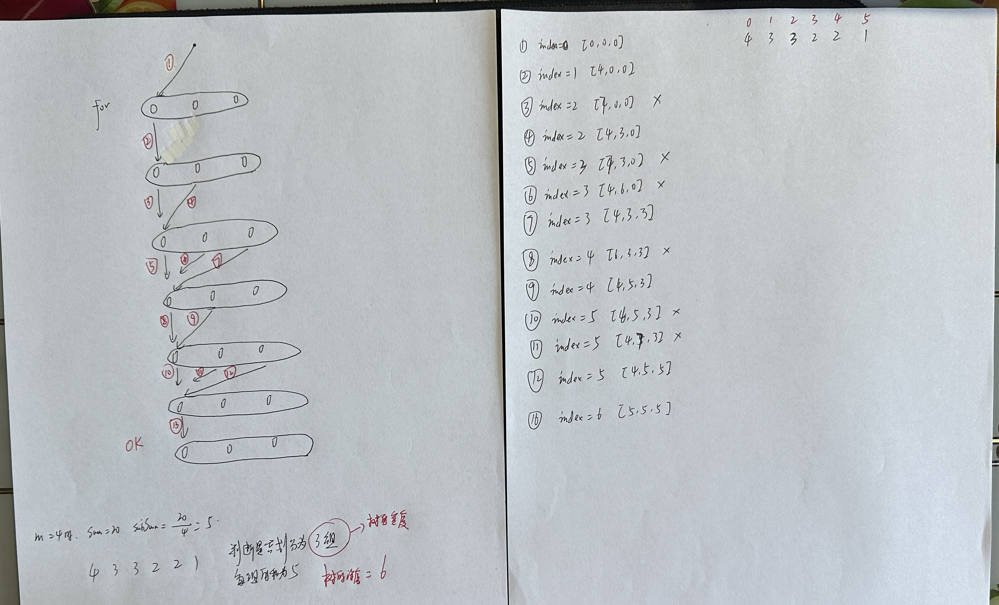

# 等和子数组最小和

## [题目链接](https://blog.csdn.net/m0_47384542/article/details/131968200)

## 代码

### 示例

```
输入
7
4 3 2 3 5 2 1


输出
5

说明：
可以等分的情况有:
4个子集：(5)，(1,4)，(2,3)，(2,3)
2个子集(5,1,4) ，(2,3,2,3) 
但最小的为5

```

### 自己

 

```c++
#include<iostream>
#include<algorithm>
#include<vector>
#include<string>
#include<numeric>

using namespace std;

bool partition(vector<int>& link, int index, vector<int>& buckets, int subSum) {
    if(index == link.size()) {
        return true;
    }
    int value = link[index];
    for(int i = 0; i < buckets.size(); i++) {
        //去重
        if(i > 0 && buckets[i] == buckets[i - 1]) {
            continue;
        }
        if(value + buckets[i] <= subSum) {
            buckets[i] += value;
            if(partition(link, index + 1, buckets, subSum)) {
                return true;
            }
            buckets[i] -= value;
        }
    }
    return false;
}

bool canPartionMSubsets(vector<int>& link, int sum, int m) {
    if(sum % m != 0) {
        return false;
    }
    int subSum = sum / m;
    //最小的元素都比subSum大则意味着永远不可能找到和为subSum的子集
    if(subSum < link[link.size() - 1]) {
        return false;
    }
    //如果最大的元素刚好为subSum，则不需要划分它
    while(!link.empty() && link[0] == subSum) {
        link.erase(link.begin());
        m--;
    }
    //划分剩余的元素，看是否能划分成相同的子集
    vector<int> buckets(m);
    return partition(link, 0, buckets, subSum);
}

int getResult(vector<int>& link, int m) {
    sort(link.begin(), link.end(), greater<int>());
    int sum = accumulate(link.begin(), link.end(), 0);
    while(m > 0) {
        if(canPartionMSubsets(link, sum, m)) {
            return sum / m;
        }
        m--;
    }
    return sum;
}

int main()
{
    int m;
    cin>>m;
    vector<int> link(m);
    for(int i = 0; i < m; i++) {
        cin>>link[i];
    }
    cout<<getResult(link, m)<<endl;
}
```

### 外部

```c++
#include <iostream>
#include <vector>
#include <algorithm>
#include <numeric>

using namespace std;

// 判断是否能将link数组分成m个子集，使得每个子集的和为sumV/m
bool canPartitionMSubsets(vector<int>& link, int sumV, int m);

// 使用回溯法递归地将link数组中的元素放入m个桶中，使得每个桶的和为subSum
bool partition(vector<int>& link, int index, vector<int>& buckets, int subSum);

int getResult(vector<int>& link, int m) {
    // 将link数组按降序排序
    sort(link.begin(), link.end(), greater<int>());

    // 计算link数组的总和
    int sumV = accumulate(link.begin(), link.end(), 0);

    while (m > 0) {
        // 如果能将link数组分成m个子集，则返回每个子集的和sumV/m
        if (canPartitionMSubsets(link, sumV, m)) {
            return sumV / m;
        }
        m--;
    }

    // 如果无法将link数组分成m个子集，则返回link数组的总和sumV
    return sumV;
}

bool canPartitionMSubsets(vector<int>& link, int sumV, int m) {
    // 如果link数组的总和不能被m整除，则无法分成m个子集
    if (sumV % m != 0) {
        return false;
    }

    // 计算每个子集的和subSum
    int subSum = sumV / m;

    // 如果link数组中的最小元素大于subSum，则无法分成m个子集
    if (subSum < link[link.size() - 1]) {
        return false;
    }

    // 从link数组中删除所有等于subSum的元素，并更新m的值
    while (!link.empty() && link[0] == subSum) {
        link.erase(link.begin());
        m--;
    }

    // 创建m个桶，用于存放link数组中的元素
    vector<int> buckets(m);

    // 使用回溯法将link数组中的元素放入桶中
    return partition(link, 0, buckets, subSum);
}

bool partition(vector<int>& link, int index, vector<int>& buckets, int subSum) {
    // 如果link数组中的所有元素都已经放入桶中，则表示成功分成m个子集
    if (index == link.size()) {
        return true;
    }

    // 选择link数组中的第index个元素
    int select = link[index];

    // 尝试将select放入每个桶中
    for (int i = 0; i < buckets.size(); i++) {
        // 如果当前桶和上一个桶的和相同，则跳过当前桶，避免重复计算
        if (i > 0 && buckets[i] == buckets[i - 1]) {
            continue;
        }

        // 如果将select放入当前桶后，当前桶的和不超过subSum，则继续递归地放入下一个元素
        if (select + buckets[i] <= subSum) {
            buckets[i] += select;
            if (partition(link, index + 1, buckets, subSum)) {
                return true;
            }
            buckets[i] -= select;
        }
    }

    // 无法将select放入任何一个桶中，则表示无法分成m个子集
    return false;
}

int main() {
    // 读取m和link数组
    int m;
    cin >> m;
    vector<int> link(m);
    for (int i = 0; i < m; i++) {
        cin >> link[i];
    }

    // 计算结果并输出
    cout << getResult(link, m) << endl;

    return 0;
}
```


