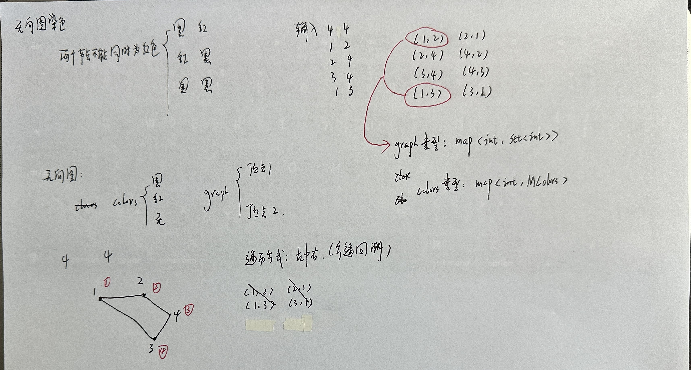

# 无向图染色

## [题目链接](https://sars2025.blog.csdn.net/article/details/131968734)

## 代码

 

```c++
#include<iostream>
#include<set>
#include<map>

using namespace std;

enum MColors {
    NULL_COLOR,
    BLACK,
    RED
};

int result = 0;

void dfs(map<int, MColors>& colors, map<int, set<int>>& graph, int index) {
    if(index == graph.size() + 1) {
        result++;
        return;
    }

    colors[index] = BLACK;
    dfs(colors, graph, index + 1);
    colors[index] = NULL_COLOR;

    bool allNodesNotRed = true;
    for(int node : graph[index]) {
        if(colors[node] == RED) {
            allNodesNotRed = false;
            break;
        }
    }
    if(allNodesNotRed) {
        colors[index] = RED;
        dfs(colors, graph, index + 1);
    }

    colors[index] = NULL_COLOR;
}

int main()
{
    int M;
    int N;
    cin>>M>>N;
    //key:    节点
    //value:  该节点的颜色
    map<int, MColors> colors;
    //key:    开始节点
    //value:  结束节点
    map<int, set<int>> graph;
    for(int i = 0; i < M; i++) {
        int v1;
        int v2;
        cin>>v1>>v2;
        graph[v1].insert(v2);
        graph[v2].insert(v1);
        colors[v1] = NULL_COLOR;
        colors[v2] = NULL_COLOR;
    }
    dfs(colors, graph, 1);
    cout<<result<<endl;
}
```

