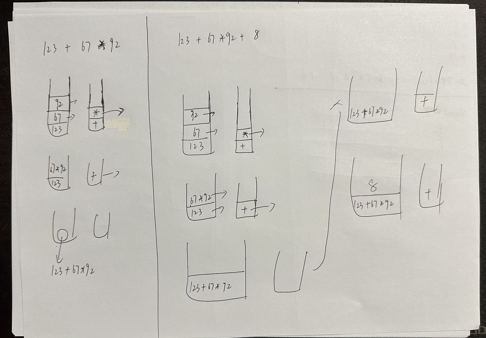

# 提取字符串中的最长数学表达式

## 题目

[442、提取字符串中的最长数学表达式](https://zifusars2025.blog.csdn.net/article/details/135237683)

## 代码

 

```c++
#include<iostream>
#include<vector>
#include<string>
#include<sstream>
#include<cctype>
#include<stack>

using namespace std;

//获取操作符的优先级
int getPriorityOfOperator(char op) {
    if(op == '+' || op == '-') {
        return 1;
    }
    if(op == '*' || op == '/') {
        return 2;
    }
}

//计算值
int computerValue(int a, int b, char op) {
    if(op == '+') {
        return a + b;
    }
    else if(op == '-') {
        return a - b;
    }
    else if(op == '*') {
        return a * b;
    }
    else if(op == '/') {
        return a / b;
    }
}

int computerStrValue(string& s) {
    stack<int> valueSt; //保存值
    stack<char> operatorSt; //保存操作符
    for(int i = 0; i < s.size(); i++) {
        if(s[i] == '+' || s[i] == '-' || s[i] == '*' || s[i] == '/') {
            while(!operatorSt.empty() && getPriorityOfOperator(operatorSt.top()) >= getPriorityOfOperator(s[i])) {
                int b = valueSt.top();
                valueSt.pop();
                int a = valueSt.top();
                valueSt.pop();
                char op = operatorSt.top();
                operatorSt.pop();
                valueSt.push(computerValue(a, b, op));
            }
            operatorSt.push(s[i]);
        }
        else {
            int value = 0;
            while(i < s.size() && isdigit(s[i])) {
                value = value * 10 + s[i] - '0';
                i++;
            }
            i--;
            valueSt.push(value);
        }
    }

    while(!operatorSt.empty()) {
        int b = valueSt.top();
        valueSt.pop();
        int a = valueSt.top();
        valueSt.pop();
        char op = operatorSt.top();
        operatorSt.pop();
        valueSt.push(computerValue(a, b, op));
    }
    return valueSt.top();
}

string findMaxDigitStr(string& s) {
    string validStr = "+-*/123456789";
    int maxLength = 0;
    int curLength = 0;
    string resultStr = "";
    int i = 0;
    for(int j = 0; j < s.size(); j++) {
        if(validStr.find(s[j]) != string::npos) {
            curLength++;
            if(curLength > maxLength) {
                maxLength = curLength;
                resultStr = s.substr(i, j - i + 1);
            }
        }
        else {
            i++;
            curLength = 0;
        }
    }
    return resultStr;
}

int main()
{
    string s;
    getline(cin, s);
    string resultStr = findMaxDigitStr(s);
    int result = computerStrValue(resultStr);
    cout<<result<<endl;
}
```

